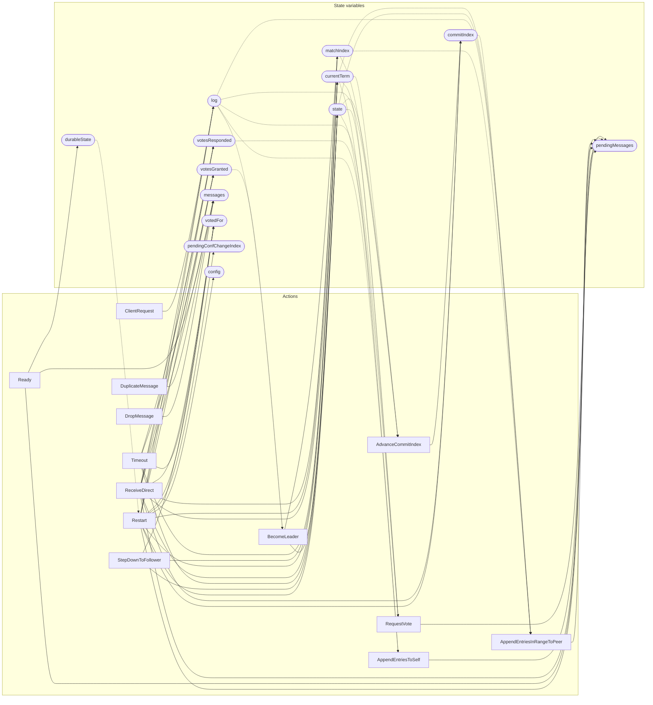

<!-- GENERATED FILE: do not edit. Regenerate with `make -C zig tla-viz` (scripts/tla-viz/gen_structural.py). -->

# etcdraft — structural diagrams

Generated from [`etcdraft.tla`](../etcdraft.tla). 14 state variables, 13 actions in `Next`.

## Actions and the state they touch

| Action | Reads (incl. helper operators) | Writes |
| --- | --- | --- |
| `RequestVote` | `pendingMessages`, `currentTerm`, `state`, `log`, `votesResponded`, `config` | `pendingMessages` |
| `BecomeLeader` | `state`, `log`, `votesGranted`, `matchIndex`, `config` | `state`, `matchIndex` |
| `ClientRequest` | `currentTerm`, `state`, `log` | `log` |
| `AdvanceCommitIndex` | `currentTerm`, `state`, `log`, `commitIndex`, `matchIndex`, `config` | `commitIndex` |
| `AppendEntriesInRangeToPeer` | `pendingMessages`, `currentTerm`, `state`, `log`, `commitIndex`, `matchIndex`, `config` | `pendingMessages` |
| `AppendEntriesToSelf` | `pendingMessages`, `currentTerm`, `state`, `log` | `pendingMessages` |
| `ReceiveDirect` | `messages`, `pendingMessages`, `currentTerm`, `state`, `votedFor`, `log`, `commitIndex`, `votesResponded`, `votesGranted`, `matchIndex` | `messages`, `pendingMessages`, `currentTerm`, `state`, `votedFor`, `log`, `commitIndex`, `votesResponded`, `votesGranted`, `matchIndex` |
| `Timeout` | `currentTerm`, `state`, `votedFor`, `votesResponded`, `votesGranted`, `config` | `currentTerm`, `state`, `votedFor`, `votesResponded`, `votesGranted` |
| `Ready` | `messages`, `pendingMessages`, `currentTerm`, `votedFor`, `log`, `commitIndex`, `config`, `durableState` | `messages`, `pendingMessages`, `durableState` |
| `StepDownToFollower` | `currentTerm`, `state`, `votedFor` | `currentTerm`, `state`, `votedFor` |
| `Restart` | `pendingMessages`, `currentTerm`, `state`, `votedFor`, `log`, `commitIndex`, `votesResponded`, `votesGranted`, `matchIndex`, `pendingConfChangeIndex`, `config`, `durableState` | `pendingMessages`, `currentTerm`, `state`, `votedFor`, `log`, `commitIndex`, `votesResponded`, `votesGranted`, `matchIndex`, `pendingConfChangeIndex`, `config` |
| `DuplicateMessage` | `messages` | `messages` |
| `DropMessage` | `messages` | `messages` |

## Write graph

Solid edges: the action updates the variable. Dotted edges: the action's own definition reads the variable (reads via helper operators appear in the table above, not here).

