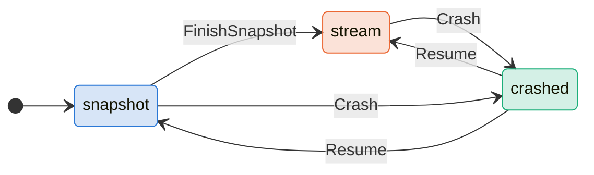
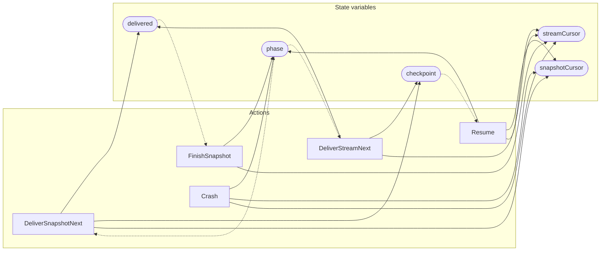

<!-- GENERATED FILE: do not edit. Regenerate with `make -C zig tla-viz` (scripts/tla-viz/gen_structural.py). -->

# AntflyCdcCutover — structural diagrams

Generated from [`AntflyCdcCutover.tla`](../../metadata/AntflyCdcCutover.tla). 5 state variables, 5 actions in `Next`. 4 expected-failure mutant action(s) (gated by `Buggy*` constants) omitted.

## Phase state machines

Transitions are extracted from action guards and primed updates; edge labels are the actions that perform the transition.

### `phase`

## Actions and the state they touch

| Action | Reads (incl. helper operators) | Writes |
| --- | --- | --- |
| `DeliverSnapshotNext` | `phase`, `delivered`, `snapshotCursor` | `delivered`, `checkpoint`, `snapshotCursor` |
| `FinishSnapshot` | `phase`, `delivered` | `phase`, `streamCursor` |
| `DeliverStreamNext` | `phase`, `delivered`, `streamCursor` | `delivered`, `checkpoint`, `streamCursor` |
| `Crash` | `phase` | `phase`, `snapshotCursor`, `streamCursor` |
| `Resume` | `phase`, `checkpoint` | `phase`, `snapshotCursor`, `streamCursor` |

## Write graph

Solid edges: the action updates the variable. Dotted edges: the action's own definition reads the variable (reads via helper operators appear in the table above, not here).

