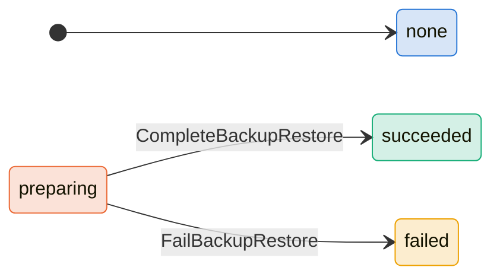
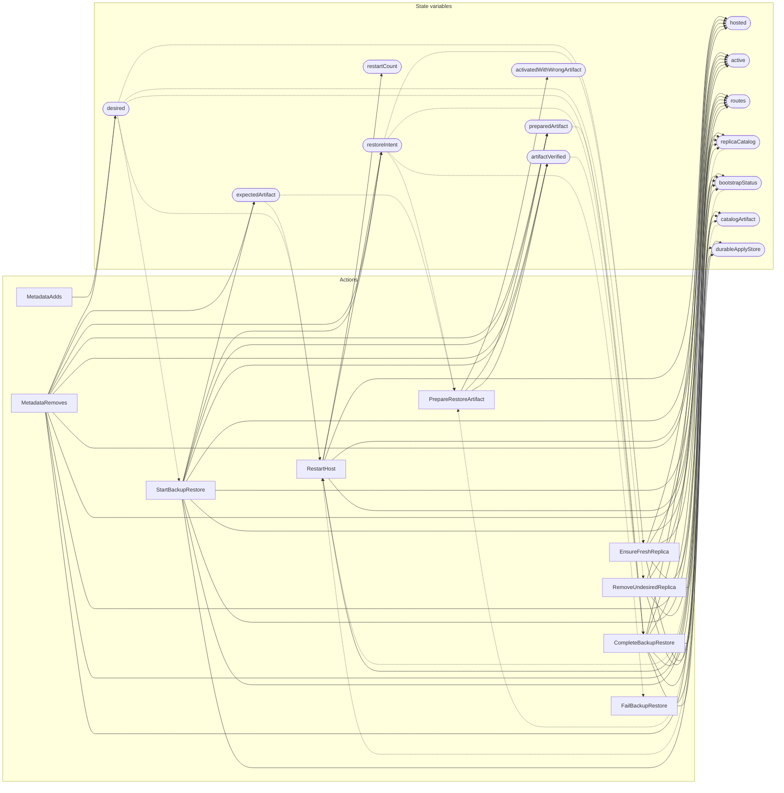

<!-- GENERATED FILE: do not edit. Regenerate with `make -C zig tla-viz` (scripts/tla-viz/gen_structural.py). -->

# AntflyManagedHostLifecycle — structural diagrams

Generated from [`AntflyManagedHostLifecycle.tla`](../../metadata/AntflyManagedHostLifecycle.tla). 14 state variables, 9 actions in `Next`.

## Phase state machines

Transitions are extracted from action guards and primed updates; edge labels are the actions that perform the transition.

### `bootstrapStatus`

Writes whose source state is not statically determined:

- `MetadataRemoves` sets `bootstrapStatus` to `"none"`
- `RestartHost` sets `bootstrapStatus` to `"none"`
- `StartBackupRestore` sets `bootstrapStatus` to `"preparing"`

### `expectedArtifact`

Domain: `none`, `bound`, `other`. No statically extractable guard/update transitions.

Writes whose source state is not statically determined:

- `MetadataRemoves` sets `expectedArtifact` to `"none"`
- `StartBackupRestore` sets `expectedArtifact` to `"bound"`

### `preparedArtifact`

Domain: `none`, `bound`, `other`. No statically extractable guard/update transitions.

Writes whose source state is not statically determined:

- `MetadataRemoves` sets `preparedArtifact` to `"none"`
- `StartBackupRestore` sets `preparedArtifact` to `"none"`

### `catalogArtifact`

Domain: `none`, `bound`, `other`. No statically extractable guard/update transitions.

Writes whose source state is not statically determined:

- `CompleteBackupRestore` sets `catalogArtifact` to `"none"`
- `MetadataRemoves` sets `catalogArtifact` to `"none"`
- `RemoveUndesiredReplica` sets `catalogArtifact` to `"none"`

## Actions and the state they touch

| Action | Reads (incl. helper operators) | Writes |
| --- | --- | --- |
| `RestartHost` | `desired`, `replicaCatalog`, `restoreIntent`, `bootstrapStatus`, `restartCount`, `expectedArtifact`, `catalogArtifact` | `hosted`, `active`, `routes`, `restoreIntent`, `bootstrapStatus`, `restartCount` |
| `MetadataAdds` | `desired` | `desired` |
| `MetadataRemoves` | `desired`, `active`, `routes`, `replicaCatalog`, `restoreIntent`, `bootstrapStatus`, `expectedArtifact`, `preparedArtifact`, `artifactVerified`, `catalogArtifact` | `desired`, `active`, `routes`, `replicaCatalog`, `restoreIntent`, `bootstrapStatus`, `expectedArtifact`, `preparedArtifact`, `artifactVerified`, `catalogArtifact` |
| `EnsureFreshReplica` | `desired`, `hosted`, `active`, `routes`, `durableApplyStore`, `replicaCatalog`, `restoreIntent` | `hosted`, `active`, `routes`, `durableApplyStore`, `replicaCatalog` |
| `StartBackupRestore` | `desired`, `hosted`, `active`, `routes`, `durableApplyStore`, `replicaCatalog`, `restoreIntent`, `bootstrapStatus`, `expectedArtifact`, `preparedArtifact`, `artifactVerified` | `hosted`, `active`, `routes`, `durableApplyStore`, `replicaCatalog`, `restoreIntent`, `bootstrapStatus`, `expectedArtifact`, `preparedArtifact`, `artifactVerified` |
| `PrepareRestoreArtifact` | `restoreIntent`, `bootstrapStatus`, `expectedArtifact`, `preparedArtifact`, `artifactVerified`, `activatedWithWrongArtifact` | `preparedArtifact`, `artifactVerified`, `activatedWithWrongArtifact` |
| `CompleteBackupRestore` | `desired`, `hosted`, `active`, `routes`, `durableApplyStore`, `replicaCatalog`, `restoreIntent`, `bootstrapStatus`, `preparedArtifact`, `artifactVerified`, `catalogArtifact` | `hosted`, `active`, `routes`, `durableApplyStore`, `replicaCatalog`, `bootstrapStatus`, `catalogArtifact` |
| `FailBackupRestore` | `restoreIntent`, `bootstrapStatus` | `bootstrapStatus` |
| `RemoveUndesiredReplica` | `desired`, `hosted`, `active`, `routes`, `replicaCatalog`, `catalogArtifact` | `hosted`, `active`, `routes`, `replicaCatalog`, `catalogArtifact` |

## Write graph

Solid edges: the action updates the variable. Dotted edges: the action's own definition reads the variable (reads via helper operators appear in the table above, not here).

