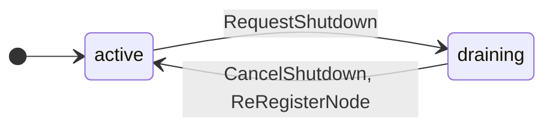
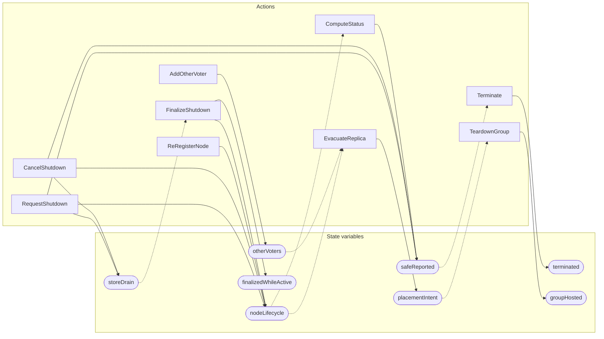

<!-- GENERATED FILE: do not edit. Regenerate with `make -C zig tla-viz` (scripts/tla-viz/gen_structural.py). -->

# AntflyNodeDrainLifecycle — structural diagrams

Generated from [`AntflyNodeDrainLifecycle.tla`](../../metadata/AntflyNodeDrainLifecycle.tla). 8 state variables, 9 actions in `Next`.

## Phase state machines

Transitions are extracted from action guards and primed updates; edge labels are the actions that perform the transition.

### `nodeLifecycle`

Writes whose source state is not statically determined:

- `FinalizeShutdown` sets `nodeLifecycle` to `"removed"`

## Actions and the state they touch

| Action | Reads (incl. helper operators) | Writes |
| --- | --- | --- |
| `RequestShutdown` | `nodeLifecycle` | `nodeLifecycle`, `storeDrain`, `safeReported` |
| `CancelShutdown` | `nodeLifecycle` | `nodeLifecycle`, `storeDrain`, `safeReported` |
| `ReRegisterNode` | `nodeLifecycle` | `nodeLifecycle` |
| `ComputeStatus` | `nodeLifecycle`, `placementIntent`, `groupHosted` | `safeReported` |
| `Terminate` | `safeReported`, `terminated` | `terminated` |
| `FinalizeShutdown` | `nodeLifecycle`, `storeDrain`, `finalizedWhileActive` | `nodeLifecycle`, `finalizedWhileActive` |
| `EvacuateReplica` | `nodeLifecycle`, `placementIntent`, `otherVoters` | `placementIntent` |
| `TeardownGroup` | `placementIntent`, `groupHosted` | `groupHosted` |
| `AddOtherVoter` | `otherVoters` | `otherVoters` |

## Write graph

Solid edges: the action updates the variable. Dotted edges: the action's own definition reads the variable (reads via helper operators appear in the table above, not here).

