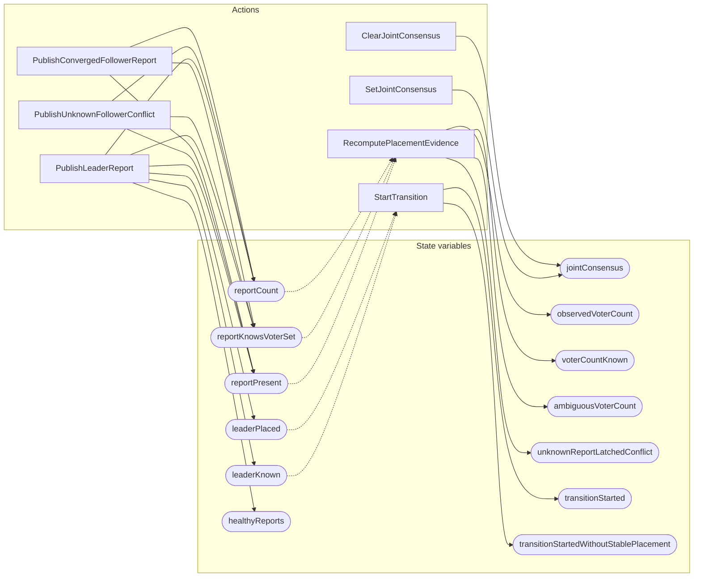

<!-- GENERATED FILE: do not edit. Regenerate with `make -C zig tla-viz` (scripts/tla-viz/gen_structural.py). -->

# AntflyPlacementReadiness — structural diagrams

Generated from [`AntflyPlacementReadiness.tla`](../../metadata/AntflyPlacementReadiness.tla). 13 state variables, 7 actions in `Next`.

## Actions and the state they touch

| Action | Reads (incl. helper operators) | Writes |
| --- | --- | --- |
| `PublishLeaderReport` | `reportPresent`, `reportKnowsVoterSet`, `reportCount`, `leaderKnown`, `leaderPlaced`, `healthyReports` | `reportPresent`, `reportKnowsVoterSet`, `reportCount`, `leaderKnown`, `leaderPlaced`, `healthyReports` |
| `PublishUnknownFollowerConflict` | `reportPresent`, `reportKnowsVoterSet`, `reportCount` | `reportPresent`, `reportKnowsVoterSet`, `reportCount` |
| `PublishConvergedFollowerReport` | `reportPresent`, `reportKnowsVoterSet`, `reportCount` | `reportPresent`, `reportKnowsVoterSet`, `reportCount` |
| `SetJointConsensus` | `jointConsensus` | `jointConsensus` |
| `ClearJointConsensus` | `jointConsensus` | `jointConsensus` |
| `RecomputePlacementEvidence` | `reportPresent`, `reportKnowsVoterSet`, `reportCount`, `observedVoterCount`, `voterCountKnown`, `ambiguousVoterCount`, `unknownReportLatchedConflict` | `observedVoterCount`, `voterCountKnown`, `ambiguousVoterCount`, `unknownReportLatchedConflict` |
| `StartTransition` | `leaderKnown`, `leaderPlaced`, `healthyReports`, `jointConsensus`, `observedVoterCount`, `voterCountKnown`, `ambiguousVoterCount`, `transitionStarted`, `transitionStartedWithoutStablePlacement` | `transitionStarted`, `transitionStartedWithoutStablePlacement` |

## Write graph

Solid edges: the action updates the variable. Dotted edges: the action's own definition reads the variable (reads via helper operators appear in the table above, not here).

