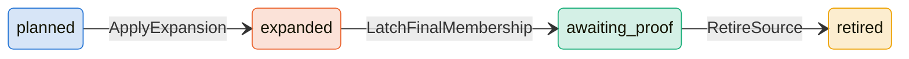
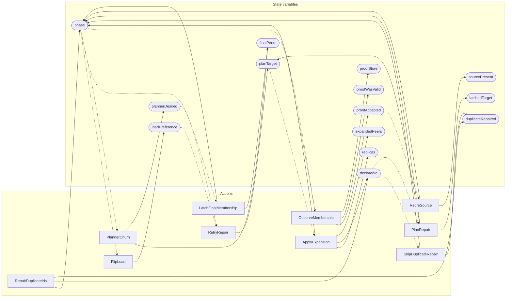

<!-- GENERATED FILE: do not edit. Regenerate with `make -C zig tla-viz` (scripts/tla-viz/gen_structural.py). -->

# AntflyPlacementRepair — structural diagrams

Generated from [`AntflyPlacementRepair.tla`](../../metadata/AntflyPlacementRepair.tla). 15 state variables, 10 actions in `Next`.

## Phase state machines

Transitions are extracted from action guards and primed updates; edge labels are the actions that perform the transition.

### `phase`

Writes whose source state is not statically determined:

- `PlanRepair` sets `phase` to `"planned"`

## Actions and the state they touch

| Action | Reads (incl. helper operators) | Writes |
| --- | --- | --- |
| `RepairDuplicateIds` | `phase`, `declaredId` | `phase`, `declaredId`, `duplicateRepaired` |
| `SkipDuplicateRepair` | `phase`, `declaredId` | `phase`, `duplicateRepaired` |
| `PlanRepair` | `phase`, `loadPreference`, `declaredId` | `phase`, `latchedTarget`, `planTarget` |
| `FlipLoad` | `phase` | `loadPreference` |
| `RetryRepair` | `phase`, `loadPreference` | `planTarget` |
| `ApplyExpansion` | `phase`, `planTarget`, `declaredId` | `phase`, `replicas`, `declaredId`, `expandedPeers` |
| `LatchFinalMembership` | `phase`, `plannerDesired` | `phase`, `finalPeers` |
| `PlannerChurn` | `phase`, `finalPeers` | `finalPeers`, `plannerDesired` |
| `ObserveMembership` | `phase`, `finalPeers`, `proofAccepted` | `proofAccepted`, `proofWasValid`, `proofStore` |
| `RetireSource` | `phase`, `proofAccepted` | `phase`, `sourcePresent` |

## Write graph

Solid edges: the action updates the variable. Dotted edges: the action's own definition reads the variable (reads via helper operators appear in the table above, not here).

