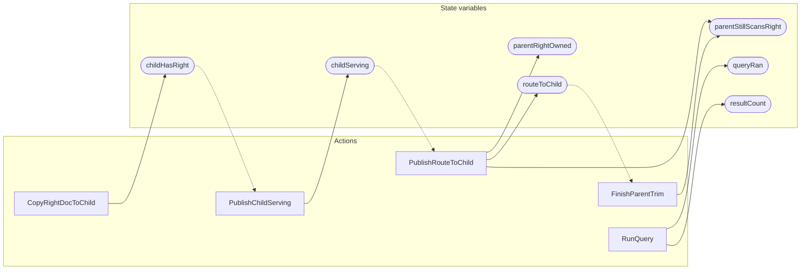

<!-- GENERATED FILE: do not edit. Regenerate with `make -C zig tla-viz` (scripts/tla-viz/gen_structural.py). -->

# AntflyQueryCompleteness — structural diagrams

Generated from [`AntflyQueryCompleteness.tla`](../../metadata/AntflyQueryCompleteness.tla). 7 state variables, 5 actions in `Next`.

## Actions and the state they touch

| Action | Reads (incl. helper operators) | Writes |
| --- | --- | --- |
| `CopyRightDocToChild` | `childHasRight` | `childHasRight` |
| `PublishChildServing` | `childHasRight`, `childServing` | `childServing` |
| `PublishRouteToChild` | `childServing`, `routeToChild` | `parentRightOwned`, `routeToChild`, `parentStillScansRight` |
| `FinishParentTrim` | `routeToChild`, `parentStillScansRight` | `parentStillScansRight` |
| `RunQuery` | `parentRightOwned`, `childHasRight`, `childServing`, `routeToChild`, `parentStillScansRight`, `queryRan` | `queryRan`, `resultCount` |

## Write graph

Solid edges: the action updates the variable. Dotted edges: the action's own definition reads the variable (reads via helper operators appear in the table above, not here).

