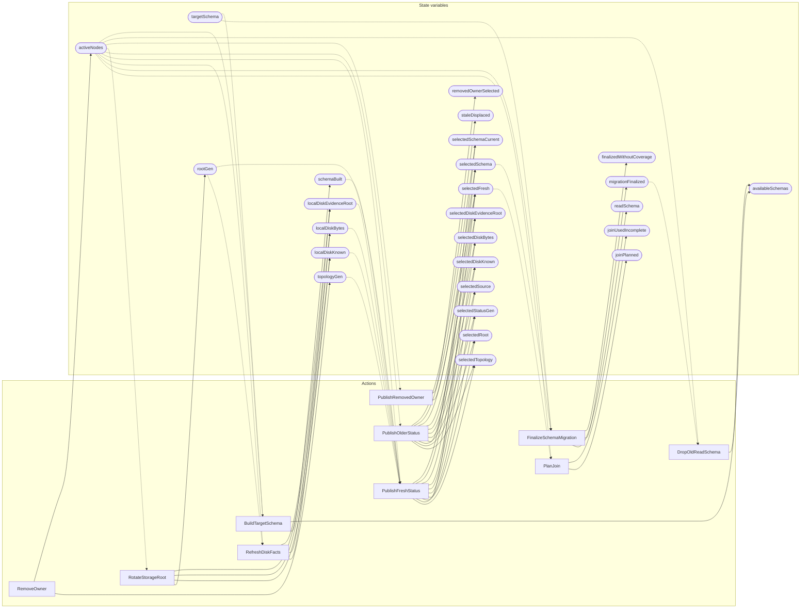

<!-- GENERATED FILE: do not edit. Regenerate with `make -C zig tla-viz` (scripts/tla-viz/gen_structural.py). -->

# AntflyRuntimeStatusReconciliation — structural diagrams

Generated from [`AntflyRuntimeStatusReconciliation.tla`](../../metadata/AntflyRuntimeStatusReconciliation.tla). 26 state variables, 10 actions in `Next`. 2 expected-failure mutant action(s) (gated by `Buggy*` constants) omitted.

## Actions and the state they touch

| Action | Reads (incl. helper operators) | Writes |
| --- | --- | --- |
| `PlanJoin` | `topologyGen`, `activeNodes`, `rootGen`, `selectedTopology`, `selectedRoot`, `selectedFresh`, `selectedSource`, `selectedDiskKnown`, `selectedDiskEvidenceRoot`, `joinPlanned` | `joinPlanned`, `joinUsedIncomplete` |
| `FinalizeSchemaMigration` | `topologyGen`, `activeNodes`, `selectedTopology`, `selectedFresh`, `selectedSchema`, `selectedSchemaCurrent`, `targetSchema`, `migrationFinalized` | `readSchema`, `migrationFinalized`, `finalizedWithoutCoverage` |
| `RefreshDiskFacts` | `activeNodes`, `rootGen`, `localDiskKnown`, `localDiskBytes`, `localDiskEvidenceRoot` | `localDiskKnown`, `localDiskBytes`, `localDiskEvidenceRoot` |
| `PublishFreshStatus` | `topologyGen`, `activeNodes`, `rootGen`, `localDiskKnown`, `localDiskBytes`, `localDiskEvidenceRoot`, `schemaBuilt`, `selectedTopology`, `selectedRoot`, `selectedStatusGen`, `selectedFresh`, `selectedSource`, `selectedDiskKnown`, `selectedDiskBytes`, `selectedDiskEvidenceRoot`, `selectedSchema`, `selectedSchemaCurrent` | `selectedTopology`, `selectedRoot`, `selectedStatusGen`, `selectedFresh`, `selectedSource`, `selectedDiskKnown`, `selectedDiskBytes`, `selectedDiskEvidenceRoot`, `selectedSchema`, `selectedSchemaCurrent` |
| `PublishOlderStatus` | `activeNodes`, `selectedTopology`, `selectedRoot`, `selectedStatusGen`, `selectedFresh`, `selectedSource`, `selectedDiskKnown`, `selectedDiskBytes`, `selectedDiskEvidenceRoot`, `selectedSchema`, `selectedSchemaCurrent` | `selectedTopology`, `selectedRoot`, `selectedStatusGen`, `selectedFresh`, `selectedSource`, `selectedDiskKnown`, `selectedDiskBytes`, `selectedDiskEvidenceRoot`, `selectedSchema`, `selectedSchemaCurrent`, `staleDisplaced` |
| `RotateStorageRoot` | `activeNodes`, `rootGen`, `localDiskKnown`, `localDiskBytes`, `localDiskEvidenceRoot` | `rootGen`, `localDiskKnown`, `localDiskBytes`, `localDiskEvidenceRoot` |
| `RemoveOwner` | `activeNodes` | `topologyGen`, `activeNodes` |
| `PublishRemovedOwner` | `activeNodes`, `selectedFresh` | `selectedFresh`, `removedOwnerSelected` |
| `DropOldReadSchema` | `activeNodes`, `availableSchemas`, `migrationFinalized` | `availableSchemas` |
| `BuildTargetSchema` | `activeNodes`, `schemaBuilt`, `availableSchemas`, `targetSchema` | `schemaBuilt`, `availableSchemas` |

## Write graph

Solid edges: the action updates the variable. Dotted edges: the action's own definition reads the variable (reads via helper operators appear in the table above, not here).

