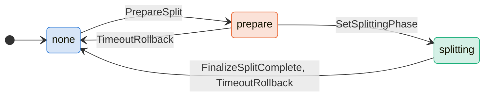
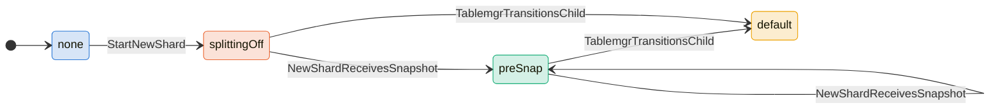
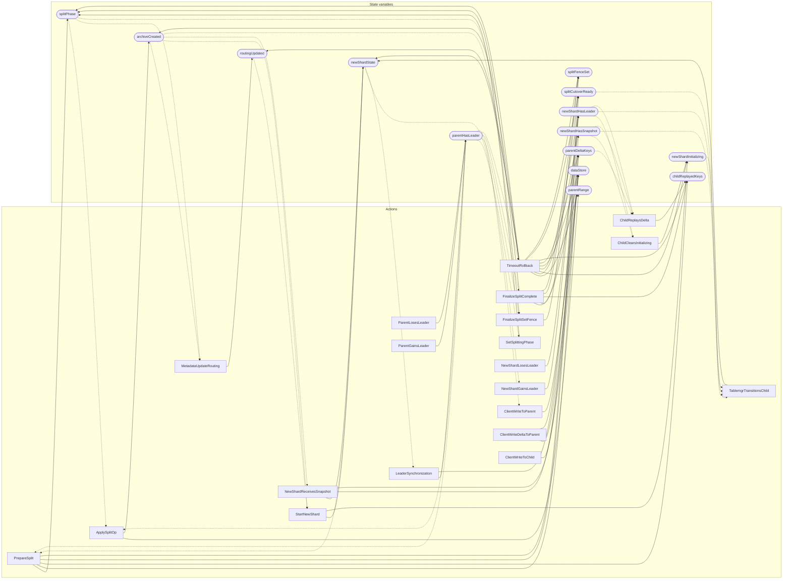

<!-- GENERATED FILE: do not edit. Regenerate with `make -C zig tla-viz` (scripts/tla-viz/gen_structural.py). -->

# AntflyShardSplit — structural diagrams

Generated from [`AntflyShardSplit.tla`](../../metadata/AntflyShardSplit.tla). 14 state variables, 20 actions in `Next`. 1 expected-failure mutant action(s) (gated by `Buggy*` constants) omitted.

## Phase state machines

Transitions are extracted from action guards and primed updates; edge labels are the actions that perform the transition.

### `splitPhase`

### `newShardState`

Writes whose source state is not statically determined:

- `TimeoutRollback` sets `newShardState` to `"none"`

### `dataStore`

Domain: `parent`, `child`, `both`. No statically extractable guard/update transitions.

Writes whose source state is not statically determined:

- `ClientWriteDeltaToParent` sets `dataStore` to `"both"`
- `ClientWriteDeltaToParent` sets `dataStore` to `"child"`
- `ClientWriteToChild` sets `dataStore` to `"both"`
- `ClientWriteToChild` sets `dataStore` to `"parent"`
- `ClientWriteToParent` sets `dataStore` to `"both"`
- `ClientWriteToParent` sets `dataStore` to `"child"`
- `FinalizeSplitComplete` sets `dataStore` to `"child"`
- `NewShardReceivesSnapshot` sets `dataStore` to `"both"`
- `NewShardReceivesSnapshot` sets `dataStore` to `"parent"`
- `TimeoutRollback` sets `dataStore` to `"parent"`

## Actions and the state they touch

| Action | Reads (incl. helper operators) | Writes |
| --- | --- | --- |
| `PrepareSplit` | `splitPhase`, `parentHasLeader`, `newShardState` | `splitPhase`, `parentDeltaKeys`, `childReplayedKeys`, `splitCutoverReady`, `splitFenceSet` |
| `SetSplittingPhase` | `splitPhase`, `parentHasLeader` | `splitPhase` |
| `ApplySplitOp` | `splitPhase`, `archiveCreated`, `parentHasLeader` | `parentRange`, `archiveCreated` |
| `MetadataUpdateRouting` | `splitPhase`, `archiveCreated`, `routingUpdated` | `routingUpdated` |
| `StartNewShard` | `archiveCreated`, `newShardState`, `routingUpdated` | `newShardState`, `newShardInitializing` |
| `NewShardReceivesSnapshot` | `archiveCreated`, `newShardState`, `newShardHasSnapshot`, `dataStore` | `newShardState`, `newShardHasSnapshot`, `dataStore` |
| `ChildClearsInitializing` | `newShardHasSnapshot`, `newShardInitializing`, `newShardHasLeader`, `parentDeltaKeys`, `childReplayedKeys` | `newShardInitializing` |
| `TablemgrTransitionsChild` | `newShardState`, `newShardHasSnapshot`, `newShardInitializing`, `newShardHasLeader`, `splitCutoverReady` | `newShardState` |
| `FinalizeSplitSetFence` | `splitPhase`, `archiveCreated`, `parentHasLeader`, `newShardHasSnapshot`, `newShardInitializing`, `newShardHasLeader`, `parentDeltaKeys`, `childReplayedKeys` | `splitFenceSet` |
| `FinalizeSplitComplete` | `splitPhase`, `parentHasLeader`, `dataStore`, `parentDeltaKeys`, `childReplayedKeys`, `splitFenceSet` | `splitPhase`, `dataStore`, `parentDeltaKeys`, `childReplayedKeys`, `splitCutoverReady`, `splitFenceSet` |
| `TimeoutRollback` | `splitPhase`, `parentHasLeader` | `splitPhase`, `parentRange`, `archiveCreated`, `newShardState`, `newShardHasSnapshot`, `newShardInitializing`, `newShardHasLeader`, `routingUpdated`, `dataStore`, `parentDeltaKeys`, `childReplayedKeys`, `splitCutoverReady`, `splitFenceSet` |
| `ParentLosesLeader` | `parentHasLeader` | `parentHasLeader` |
| `ParentGainsLeader` | `parentHasLeader` | `parentHasLeader` |
| `NewShardLosesLeader` | `newShardHasLeader` | `newShardHasLeader` |
| `NewShardGainsLeader` | `newShardState`, `newShardHasLeader` | `newShardHasLeader` |
| `LeaderSynchronization` | `parentHasLeader`, `newShardState`, `newShardHasLeader` | `parentHasLeader`, `newShardHasLeader` |
| `ClientWriteToParent` | `splitPhase`, `parentRange`, `parentHasLeader`, `dataStore` | `dataStore` |
| `ClientWriteDeltaToParent` | `splitPhase`, `parentHasLeader`, `newShardState`, `newShardHasSnapshot`, `newShardInitializing`, `newShardHasLeader`, `routingUpdated`, `dataStore`, `parentDeltaKeys`, `splitCutoverReady` | `dataStore`, `parentDeltaKeys` |
| `ClientWriteToChild` | `newShardState`, `newShardHasSnapshot`, `newShardInitializing`, `newShardHasLeader`, `routingUpdated`, `dataStore`, `splitCutoverReady` | `dataStore` |
| `ChildReplaysDelta` | `newShardHasSnapshot`, `newShardHasLeader`, `parentDeltaKeys`, `childReplayedKeys` | `childReplayedKeys` |

## Write graph

Solid edges: the action updates the variable. Dotted edges: the action's own definition reads the variable (reads via helper operators appear in the table above, not here).

