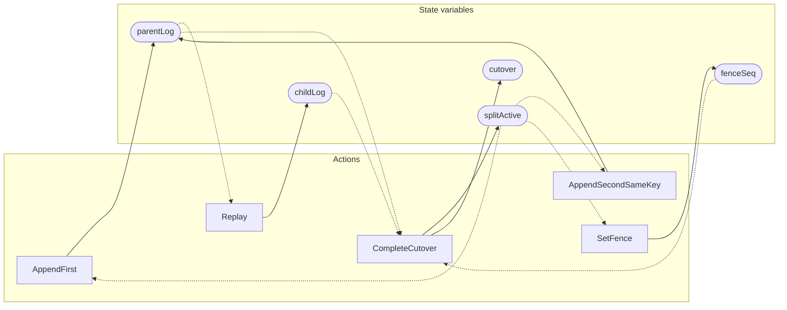

<!-- GENERATED FILE: do not edit. Regenerate with `make -C zig tla-viz` (scripts/tla-viz/gen_structural.py). -->

# AntflyShardSplitSeq — structural diagrams

Generated from [`AntflyShardSplitSeq.tla`](../../metadata/AntflyShardSplitSeq.tla). 5 state variables, 5 actions in `Next`.

## Actions and the state they touch

| Action | Reads (incl. helper operators) | Writes |
| --- | --- | --- |
| `AppendFirst` | `parentLog`, `splitActive` | `parentLog` |
| `AppendSecondSameKey` | `parentLog`, `splitActive` | `parentLog` |
| `Replay` | `parentLog`, `childLog` | `childLog` |
| `SetFence` | `parentLog`, `splitActive`, `fenceSeq` | `fenceSeq` |
| `CompleteCutover` | `parentLog`, `childLog`, `splitActive`, `fenceSeq` | `splitActive`, `cutover` |

## Write graph

Solid edges: the action updates the variable. Dotted edges: the action's own definition reads the variable (reads via helper operators appear in the table above, not here).

