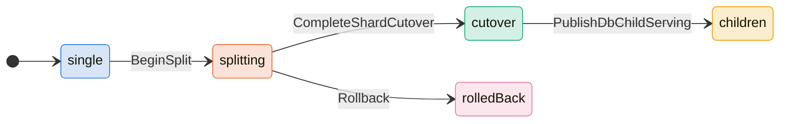
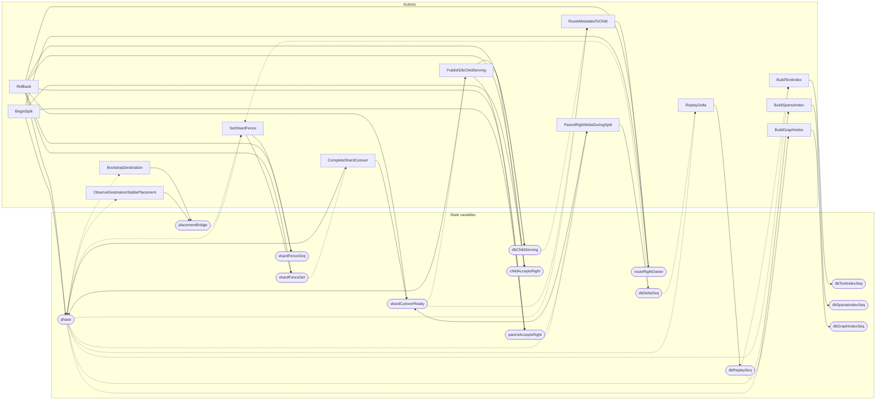

<!-- GENERATED FILE: do not edit. Regenerate with `make -C zig tla-viz` (scripts/tla-viz/gen_structural.py). -->

# AntflySplitRefinementBridge — structural diagrams

Generated from [`AntflySplitRefinementBridge.tla`](../../metadata/AntflySplitRefinementBridge.tla). 15 state variables, 13 actions in `Next`. 3 expected-failure mutant action(s) (gated by `Buggy*` constants) omitted.

## Phase state machines

Transitions are extracted from action guards and primed updates; edge labels are the actions that perform the transition.

### `phase`

### `routeRightOwner`

Domain: `parent`, `child`. No statically extractable guard/update transitions.

Writes whose source state is not statically determined:

- `BeginSplit` sets `routeRightOwner` to `"parent"`
- `Rollback` sets `routeRightOwner` to `"parent"`
- `RouteMetadataToChild` sets `routeRightOwner` to `"child"`

## Actions and the state they touch

| Action | Reads (incl. helper operators) | Writes |
| --- | --- | --- |
| `BeginSplit` | `phase` | `phase`, `parentAcceptsRight`, `childAcceptsRight`, `routeRightOwner` |
| `ObserveDestinationStablePlacement` | `phase`, `placementBridge` | `placementBridge` |
| `BootstrapDestination` | `phase`, `placementBridge` | `placementBridge` |
| `ParentRightWriteDuringSplit` | `phase`, `dbDeltaSeq`, `parentAcceptsRight` | `shardCutoverReady`, `dbDeltaSeq` |
| `ReplayDelta` | `phase`, `dbDeltaSeq`, `dbReplaySeq` | `dbReplaySeq` |
| `BuildTextIndex` | `phase`, `dbReplaySeq`, `dbTextIndexSeq` | `dbTextIndexSeq` |
| `BuildSparseIndex` | `phase`, `dbReplaySeq`, `dbSparseIndexSeq` | `dbSparseIndexSeq` |
| `BuildGraphIndex` | `phase`, `dbReplaySeq`, `dbGraphIndexSeq` | `dbGraphIndexSeq` |
| `SetShardFence` | `phase`, `dbDeltaSeq`, `dbReplaySeq`, `placementBridge` | `shardFenceSet`, `shardFenceSeq` |
| `CompleteShardCutover` | `phase`, `shardFenceSet`, `dbDeltaSeq`, `dbReplaySeq` | `phase`, `shardCutoverReady` |
| `PublishDbChildServing` | `phase`, `shardCutoverReady`, `dbDeltaSeq`, `dbReplaySeq`, `dbTextIndexSeq`, `dbSparseIndexSeq`, `dbGraphIndexSeq` | `phase`, `dbChildServing`, `parentAcceptsRight`, `childAcceptsRight` |
| `RouteMetadataToChild` | `phase`, `shardCutoverReady`, `dbChildServing` | `routeRightOwner` |
| `Rollback` | `phase` | `phase`, `shardFenceSet`, `shardFenceSeq`, `shardCutoverReady`, `dbChildServing`, `parentAcceptsRight`, `childAcceptsRight`, `routeRightOwner` |

## Write graph

Solid edges: the action updates the variable. Dotted edges: the action's own definition reads the variable (reads via helper operators appear in the table above, not here).

