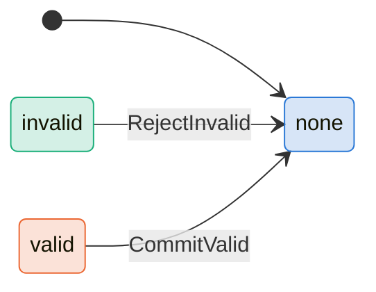
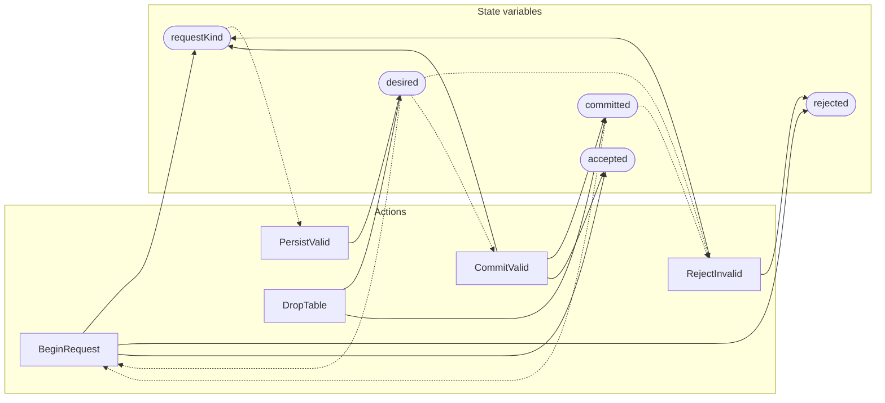

<!-- GENERATED FILE: do not edit. Regenerate with `make -C zig tla-viz` (scripts/tla-viz/gen_structural.py). -->

# AntflyTableAdmission — structural diagrams

Generated from [`AntflyTableAdmission.tla`](../../metadata/AntflyTableAdmission.tla). 5 state variables, 5 actions in `Next`. 1 expected-failure mutant action(s) (gated by `Buggy*` constants) omitted.

## Phase state machines

Transitions are extracted from action guards and primed updates; edge labels are the actions that perform the transition.

### `requestKind`

## Actions and the state they touch

| Action | Reads (incl. helper operators) | Writes |
| --- | --- | --- |
| `BeginRequest` | `requestKind`, `desired`, `committed` | `requestKind`, `rejected`, `accepted` |
| `RejectInvalid` | `requestKind`, `desired`, `committed` | `requestKind`, `rejected` |
| `PersistValid` | `requestKind`, `desired` | `desired` |
| `CommitValid` | `requestKind`, `desired`, `committed` | `requestKind`, `committed`, `accepted` |
| `DropTable` | `desired`, `committed` | `desired`, `committed` |

## Write graph

Solid edges: the action updates the variable. Dotted edges: the action's own definition reads the variable (reads via helper operators appear in the table above, not here).

