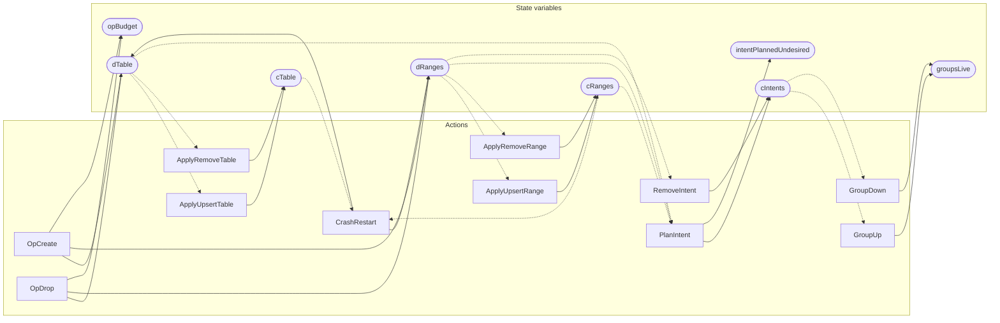

<!-- GENERATED FILE: do not edit. Regenerate with `make -C zig tla-viz` (scripts/tla-viz/gen_structural.py). -->

# AntflyTableLifecycle — structural diagrams

Generated from [`AntflyTableLifecycle.tla`](../../metadata/AntflyTableLifecycle.tla). 8 state variables, 11 actions in `Next`. 1 expected-failure mutant action(s) (gated by `Buggy*` constants) omitted.

## Actions and the state they touch

| Action | Reads (incl. helper operators) | Writes |
| --- | --- | --- |
| `OpCreate` | `dTable`, `opBudget` | `dTable`, `dRanges`, `opBudget` |
| `OpDrop` | `dTable`, `opBudget` | `dTable`, `dRanges`, `opBudget` |
| `ApplyUpsertTable` | `dTable`, `cTable` | `cTable` |
| `ApplyRemoveTable` | `dTable`, `cTable` | `cTable` |
| `CrashRestart` | `cTable`, `cRanges` | `dTable`, `dRanges` |
| `ApplyUpsertRange` | `dRanges`, `cRanges` | `cRanges` |
| `ApplyRemoveRange` | `dRanges`, `cRanges` | `cRanges` |
| `PlanIntent` | `dTable`, `dRanges`, `cRanges`, `cIntents`, `intentPlannedUndesired` | `cIntents`, `intentPlannedUndesired` |
| `RemoveIntent` | `dRanges`, `cIntents` | `cIntents` |
| `GroupUp` | `cIntents`, `groupsLive` | `groupsLive` |
| `GroupDown` | `cIntents`, `groupsLive` | `groupsLive` |

## Write graph

Solid edges: the action updates the variable. Dotted edges: the action's own definition reads the variable (reads via helper operators appear in the table above, not here).

