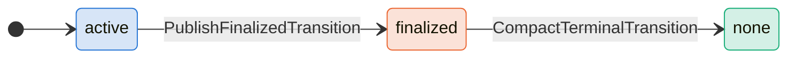
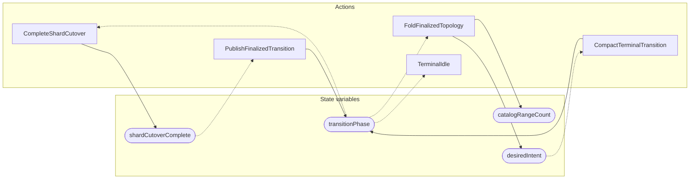

<!-- GENERATED FILE: do not edit. Regenerate with `make -C zig tla-viz` (scripts/tla-viz/gen_structural.py). -->

# AntflyTerminalTopologyPublication — structural diagrams

Generated from [`AntflyTerminalTopologyPublication.tla`](../../metadata/AntflyTerminalTopologyPublication.tla). 4 state variables, 5 actions in `Next`. 1 expected-failure mutant action(s) (gated by `Buggy*` constants) omitted.

## Phase state machines

Transitions are extracted from action guards and primed updates; edge labels are the actions that perform the transition.

### `transitionPhase`

## Actions and the state they touch

| Action | Reads (incl. helper operators) | Writes |
| --- | --- | --- |
| `CompleteShardCutover` | `shardCutoverComplete`, `transitionPhase` | `shardCutoverComplete` |
| `PublishFinalizedTransition` | `shardCutoverComplete`, `transitionPhase` | `transitionPhase` |
| `FoldFinalizedTopology` | `transitionPhase`, `desiredIntent` | `catalogRangeCount`, `desiredIntent` |
| `CompactTerminalTransition` | `transitionPhase`, `desiredIntent` | `transitionPhase` |
| `TerminalIdle` | `transitionPhase` | — |

## Write graph

Solid edges: the action updates the variable. Dotted edges: the action's own definition reads the variable (reads via helper operators appear in the table above, not here).

