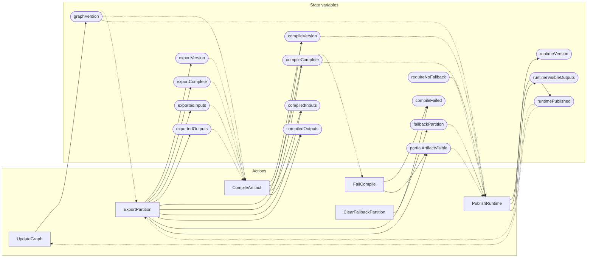

<!-- GENERATED FILE: do not edit. Regenerate with `make -C zig tla-viz` (scripts/tla-viz/gen_structural.py). -->

# AntflyMlCompilerPublication — structural diagrams

Generated from [`AntflyMlCompilerPublication.tla`](../../ml/AntflyMlCompilerPublication.tla). 16 state variables, 6 actions in `Next`.

## Actions and the state they touch

| Action | Reads (incl. helper operators) | Writes |
| --- | --- | --- |
| `UpdateGraph` | `graphVersion`, `runtimePublished` | `graphVersion` |
| `ExportPartition` | `graphVersion`, `exportVersion`, `runtimePublished` | `exportVersion`, `exportComplete`, `exportedInputs`, `exportedOutputs`, `compileVersion`, `compileComplete`, `compiledInputs`, `compiledOutputs`, `compileFailed`, `partialArtifactVisible` |
| `CompileArtifact` | `graphVersion`, `exportVersion`, `exportComplete`, `exportedInputs`, `exportedOutputs`, `compileComplete` | `compileVersion`, `compileComplete`, `compiledInputs`, `compiledOutputs` |
| `FailCompile` | `compileComplete`, `compileFailed` | `compileFailed`, `partialArtifactVisible` |
| `ClearFallbackPartition` | `fallbackPartition` | `fallbackPartition` |
| `PublishRuntime` | `graphVersion`, `compileVersion`, `compileComplete`, `partialArtifactVisible`, `fallbackPartition`, `requireNoFallback`, `runtimePublished` | `runtimePublished`, `runtimeVersion`, `runtimeVisibleOutputs` |

## Write graph

Solid edges: the action updates the variable. Dotted edges: the action's own definition reads the variable (reads via helper operators appear in the table above, not here).

