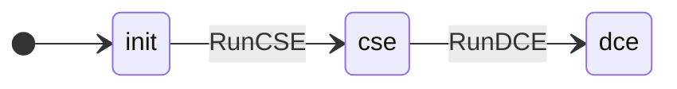
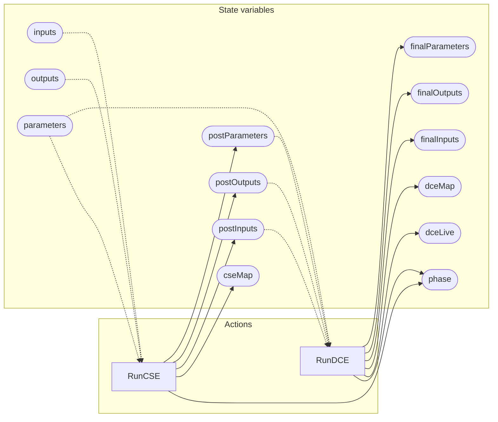

<!-- GENERATED FILE: do not edit. Regenerate with `make -C zig tla-viz` (scripts/tla-viz/gen_structural.py). -->

# AntflyMlGraphDagPasses — structural diagrams

Generated from [`AntflyMlGraphDagPasses.tla`](../../ml/AntflyMlGraphDagPasses.tla). 14 state variables, 2 actions in `Next`.

## Phase state machines

Transitions are extracted from action guards and primed updates; edge labels are the actions that perform the transition.

### `phase`

### `kind`

Domain: `param`, `const`, `opA`, `opB`, `opC`. No statically extractable guard/update transitions.

## Actions and the state they touch

| Action | Reads (incl. helper operators) | Writes |
| --- | --- | --- |
| `RunCSE` | `phase`, `kind`, `inputs`, `outputs`, `parameters` | `phase`, `cseMap`, `postInputs`, `postOutputs`, `postParameters` |
| `RunDCE` | `phase`, `parameters`, `postInputs`, `postOutputs`, `postParameters` | `phase`, `dceLive`, `dceMap`, `finalInputs`, `finalOutputs`, `finalParameters` |

## Write graph

Solid edges: the action updates the variable. Dotted edges: the action's own definition reads the variable (reads via helper operators appear in the table above, not here).

