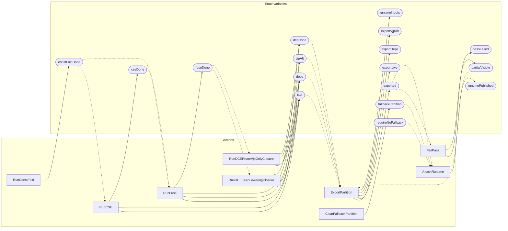

<!-- GENERATED FILE: do not edit. Regenerate with `make -C zig tla-viz` (scripts/tla-viz/gen_structural.py). -->

# AntflyMlGraphPasses — structural diagrams

Generated from [`AntflyMlGraphPasses.tla`](../../ml/AntflyMlGraphPasses.tla). 18 state variables, 9 actions in `Next`.

## Actions and the state they touch

| Action | Reads (incl. helper operators) | Writes |
| --- | --- | --- |
| `RunConstFold` | `constFoldDone` | `constFoldDone` |
| `RunCSE` | `live`, `deps`, `constFoldDone`, `cseDone` | `live`, `deps`, `cseDone` |
| `RunFuse` | `live`, `vjpAlt`, `constFoldDone`, `cseDone`, `fuseDone` | `live`, `deps`, `vjpAlt`, `fuseDone` |
| `RunDCEKeepLoweringClosure` | `live`, `fuseDone`, `dceDone` | `live`, `deps`, `dceDone` |
| `RunDCEPruneVjpOnlyClosure` | `live`, `vjpAlt`, `fuseDone`, `dceDone` | `live`, `deps`, `vjpAlt`, `dceDone` |
| `FailPass` | `passFailed`, `exported` | `passFailed`, `partialVisible` |
| `ExportPartition` | `live`, `deps`, `vjpAlt`, `dceDone`, `partialVisible`, `exported` | `exported`, `exportLive`, `exportDeps`, `exportVjpAlt`, `runtimeInputs` |
| `ClearFallbackPartition` | `fallbackPartition` | `fallbackPartition` |
| `AttachRuntime` | `exported`, `fallbackPartition`, `requireNoFallback`, `runtimePublished` | `runtimePublished` |

## Write graph

Solid edges: the action updates the variable. Dotted edges: the action's own definition reads the variable (reads via helper operators appear in the table above, not here).

