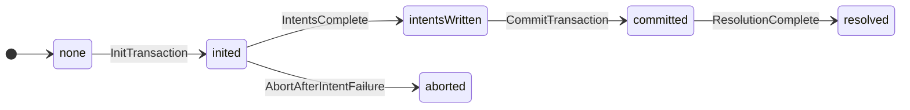
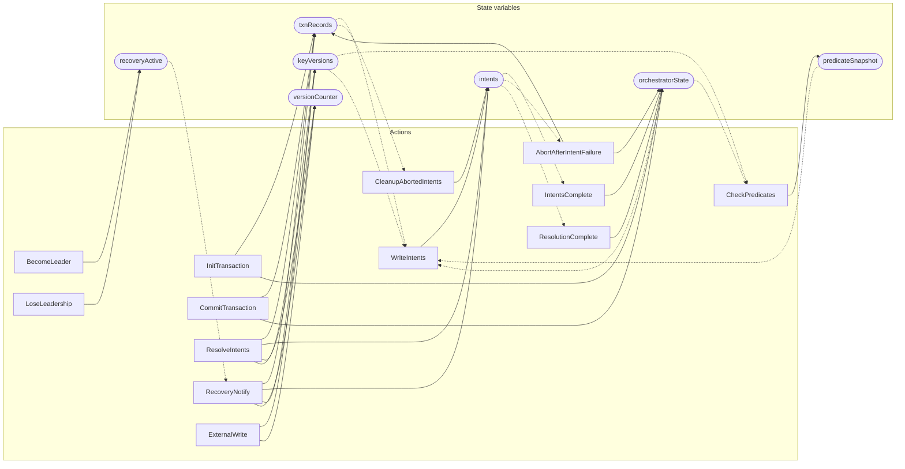

<!-- GENERATED FILE: do not edit. Regenerate with `make -C zig tla-viz` (scripts/tla-viz/gen_structural.py). -->

# model — structural diagrams

Generated from [`occ-2pc.tla`](../occ-2pc.tla). 7 state variables, 13 actions in `Next`.

## Phase state machines

Transitions are extracted from action guards and primed updates; edge labels are the actions that perform the transition.

### `orchestratorState`

## Actions and the state they touch

| Action | Reads (incl. helper operators) | Writes |
| --- | --- | --- |
| `InitTransaction` | `txnRecords`, `orchestratorState` | `txnRecords`, `orchestratorState` |
| `CheckPredicates` | `keyVersions`, `orchestratorState`, `predicateSnapshot` | `predicateSnapshot` |
| `WriteIntents` | `txnRecords`, `intents`, `keyVersions`, `orchestratorState`, `predicateSnapshot` | `intents` |
| `IntentsComplete` | `intents`, `orchestratorState` | `orchestratorState` |
| `AbortAfterIntentFailure` | `txnRecords`, `intents`, `orchestratorState` | `txnRecords`, `orchestratorState` |
| `CommitTransaction` | `txnRecords`, `orchestratorState` | `txnRecords`, `orchestratorState` |
| `ResolveIntents` | `txnRecords`, `intents`, `keyVersions`, `versionCounter` | `txnRecords`, `intents`, `keyVersions`, `versionCounter` |
| `ResolutionComplete` | `intents`, `orchestratorState` | `orchestratorState` |
| `CleanupAbortedIntents` | `txnRecords`, `intents` | `intents` |
| `RecoveryNotify` | `txnRecords`, `intents`, `keyVersions`, `versionCounter`, `recoveryActive` | `txnRecords`, `intents`, `keyVersions`, `versionCounter` |
| `BecomeLeader` | `recoveryActive` | `recoveryActive` |
| `LoseLeadership` | `recoveryActive` | `recoveryActive` |
| `ExternalWrite` | `keyVersions`, `versionCounter` | `keyVersions`, `versionCounter` |

## Write graph

Solid edges: the action updates the variable. Dotted edges: the action's own definition reads the variable (reads via helper operators appear in the table above, not here).

