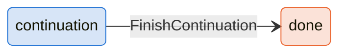
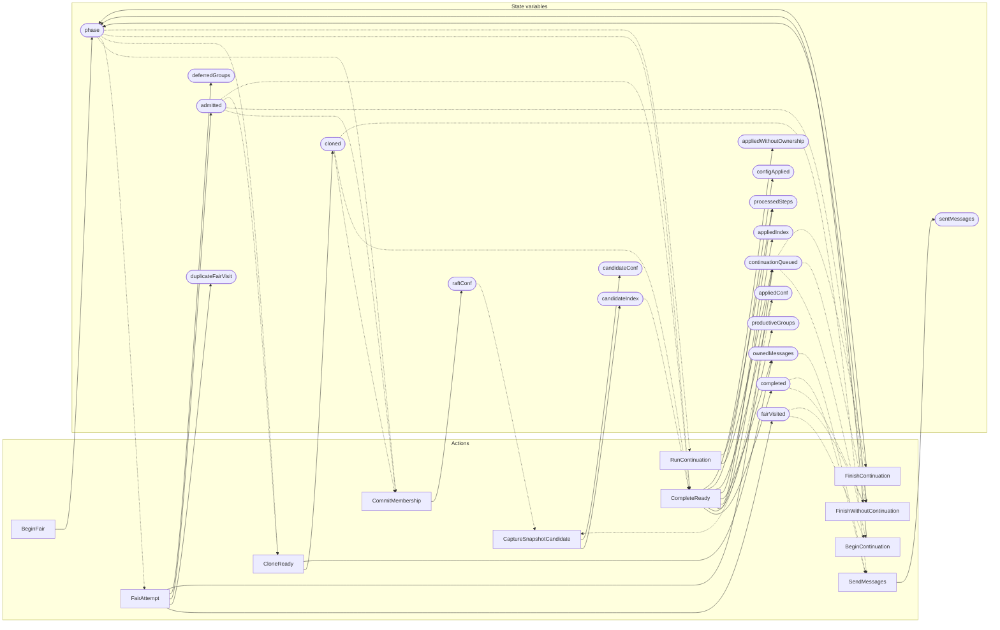

<!-- GENERATED FILE: do not edit. Regenerate with `make -C zig tla-viz` (scripts/tla-viz/gen_structural.py). -->

# AntflyRaftReadyPipeline — structural diagrams

Generated from [`AntflyRaftReadyPipeline.tla`](../../raft/AntflyRaftReadyPipeline.tla). 19 state variables, 11 actions in `Next`. 1 expected-failure mutant action(s) (gated by `Buggy*` constants) omitted.

## Phase state machines

Transitions are extracted from action guards and primed updates; edge labels are the actions that perform the transition.

### `phase`

Writes whose source state is not statically determined:

- `BeginContinuation` sets `phase` to `"continuation"`
- `FinishWithoutContinuation` sets `phase` to `"done"`

## Actions and the state they touch

| Action | Reads (incl. helper operators) | Writes |
| --- | --- | --- |
| `BeginFair` | `phase` | `phase` |
| `CommitMembership` | `phase`, `admitted`, `cloned`, `raftConf` | `raftConf` |
| `CaptureSnapshotCandidate` | `raftConf`, `appliedConf`, `candidateIndex` | `candidateIndex`, `candidateConf` |
| `BeginContinuation` | `phase`, `fairVisited`, `continuationQueued` | `phase` |
| `FinishWithoutContinuation` | `phase`, `fairVisited`, `admitted`, `completed`, `continuationQueued` | `phase` |
| `FinishContinuation` | `phase`, `continuationQueued` | `phase` |
| `FairAttempt` | `phase`, `fairVisited`, `duplicateFairVisit`, `admitted`, `deferredGroups`, `continuationQueued` | `fairVisited`, `duplicateFairVisit`, `admitted`, `deferredGroups`, `continuationQueued` |
| `CloneReady` | `phase`, `admitted`, `cloned`, `ownedMessages` | `cloned`, `ownedMessages` |
| `CompleteReady` | `phase`, `admitted`, `cloned`, `completed`, `productiveGroups`, `continuationQueued`, `processedSteps`, `ownedMessages`, `appliedIndex`, `appliedConf`, `candidateIndex`, `configApplied`, `appliedWithoutOwnership` | `completed`, `productiveGroups`, `continuationQueued`, `processedSteps`, `ownedMessages`, `appliedIndex`, `appliedConf`, `configApplied`, `appliedWithoutOwnership` |
| `SendMessages` | `cloned`, `completed`, `ownedMessages`, `sentMessages` | `sentMessages` |
| `RunContinuation` | `phase`, `continuationQueued`, `processedSteps` | `continuationQueued`, `processedSteps` |

## Write graph

Solid edges: the action updates the variable. Dotted edges: the action's own definition reads the variable (reads via helper operators appear in the table above, not here).

