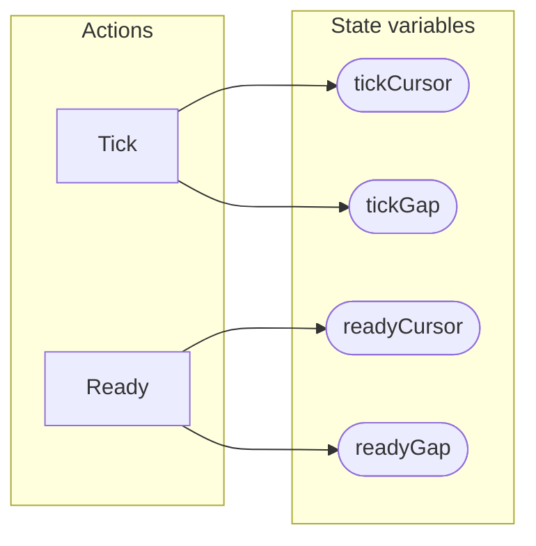

<!-- GENERATED FILE: do not edit. Regenerate with `make -C zig tla-viz` (scripts/tla-viz/gen_structural.py). -->

# AntflyRaftSchedulerFairness — structural diagrams

Generated from [`AntflyRaftSchedulerFairness.tla`](../../raft/AntflyRaftSchedulerFairness.tla). 4 state variables, 2 actions in `Next`.

## Actions and the state they touch

| Action | Reads (incl. helper operators) | Writes |
| --- | --- | --- |
| `Tick` | `tickCursor`, `tickGap` | `tickCursor`, `tickGap` |
| `Ready` | `readyCursor`, `readyGap` | `readyCursor`, `readyGap` |

## Write graph

Solid edges: the action updates the variable. Dotted edges: the action's own definition reads the variable (reads via helper operators appear in the table above, not here).

