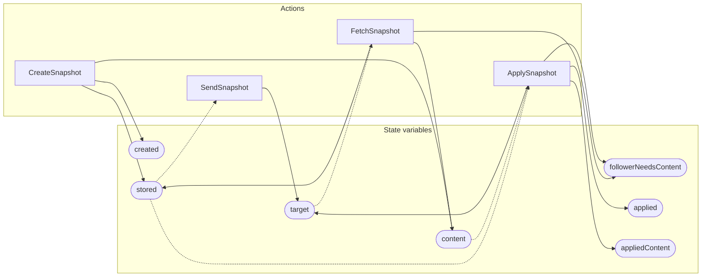

<!-- GENERATED FILE: do not edit. Regenerate with `make -C zig tla-viz` (scripts/tla-viz/gen_structural.py). -->

# AntflySnapshotContent — structural diagrams

Generated from [`AntflySnapshotContent.tla`](../../raft/AntflySnapshotContent.tla). 7 state variables, 4 actions in `Next`. 1 expected-failure mutant action(s) (gated by `Buggy*` constants) omitted.

## Actions and the state they touch

| Action | Reads (incl. helper operators) | Writes |
| --- | --- | --- |
| `CreateSnapshot` | `created`, `stored`, `content` | `created`, `stored`, `content` |
| `SendSnapshot` | `stored`, `target` | `target` |
| `FetchSnapshot` | `stored`, `content`, `target` | `stored`, `content`, `followerNeedsContent` |
| `ApplySnapshot` | `stored`, `content`, `target`, `applied`, `appliedContent` | `target`, `followerNeedsContent`, `applied`, `appliedContent` |

## Write graph

Solid edges: the action updates the variable. Dotted edges: the action's own definition reads the variable (reads via helper operators appear in the table above, not here).

