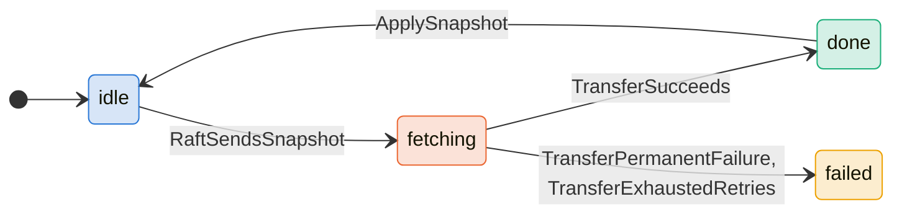
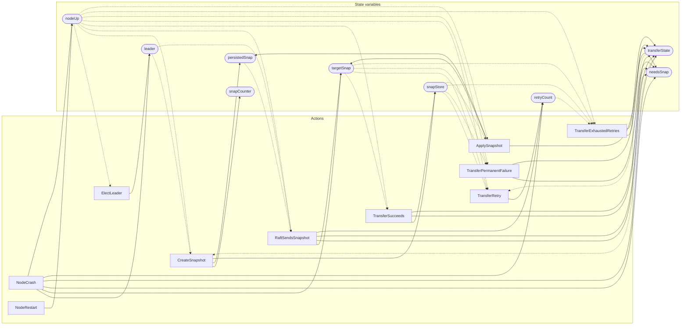

<!-- GENERATED FILE: do not edit. Regenerate with `make -C zig tla-viz` (scripts/tla-viz/gen_structural.py). -->

# AntflySnapshotTransfer — structural diagrams

Generated from [`AntflySnapshotTransfer.tla`](../../raft/AntflySnapshotTransfer.tla). 9 state variables, 10 actions in `Next`. 1 expected-failure mutant action(s) (gated by `Buggy*` constants) omitted.

## Phase state machines

Transitions are extracted from action guards and primed updates; edge labels are the actions that perform the transition.

### `transferState`

Writes whose source state is not statically determined:

- `NodeCrash` sets `transferState` to `"idle"`

## Actions and the state they touch

| Action | Reads (incl. helper operators) | Writes |
| --- | --- | --- |
| `ElectLeader` | `nodeUp` | `leader` |
| `CreateSnapshot` | `leader`, `snapCounter`, `persistedSnap`, `snapStore`, `transferState`, `nodeUp` | `snapCounter`, `persistedSnap`, `snapStore` |
| `RaftSendsSnapshot` | `leader`, `persistedSnap`, `targetSnap`, `needsSnap`, `transferState`, `retryCount`, `nodeUp` | `targetSnap`, `needsSnap`, `transferState`, `retryCount` |
| `TransferSucceeds` | `targetSnap`, `snapStore`, `needsSnap`, `transferState`, `nodeUp` | `snapStore`, `needsSnap`, `transferState` |
| `TransferRetry` | `targetSnap`, `snapStore`, `transferState`, `retryCount`, `nodeUp` | `retryCount` |
| `TransferPermanentFailure` | `targetSnap`, `snapStore`, `needsSnap`, `transferState`, `nodeUp` | `needsSnap`, `transferState` |
| `TransferExhaustedRetries` | `targetSnap`, `snapStore`, `needsSnap`, `transferState`, `retryCount`, `nodeUp` | `needsSnap`, `transferState` |
| `ApplySnapshot` | `persistedSnap`, `targetSnap`, `snapStore`, `transferState`, `nodeUp` | `persistedSnap`, `targetSnap`, `transferState` |
| `NodeCrash` | `leader`, `targetSnap`, `needsSnap`, `transferState`, `retryCount`, `nodeUp` | `leader`, `targetSnap`, `needsSnap`, `transferState`, `retryCount`, `nodeUp` |
| `NodeRestart` | `nodeUp` | `nodeUp` |

## Write graph

Solid edges: the action updates the variable. Dotted edges: the action's own definition reads the variable (reads via helper operators appear in the table above, not here).

