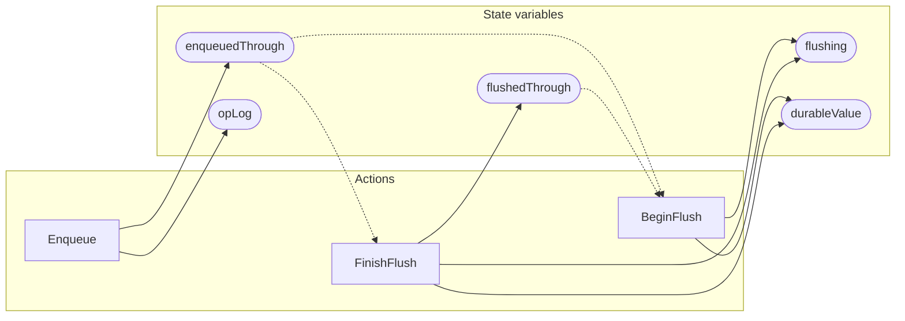

<!-- GENERATED FILE: do not edit. Regenerate with `make -C zig tla-viz` (scripts/tla-viz/gen_structural.py). -->

# AntflyBatcherCoalescing — structural diagrams

Generated from [`AntflyBatcherCoalescing.tla`](../../../storage/db/AntflyBatcherCoalescing.tla). 5 state variables, 3 actions in `Next`.

## Phase state machines

Transitions are extracted from action guards and primed updates; edge labels are the actions that perform the transition.

### `opLog`

Domain: `delete`, `write`, `none`. No statically extractable guard/update transitions.

### `durableValue`

Domain: `none`, `deleted`, `written`, `partial`. No statically extractable guard/update transitions.

Writes whose source state is not statically determined:

- `BeginFlush` sets `durableValue` to `"partial"`

## Actions and the state they touch

| Action | Reads (incl. helper operators) | Writes |
| --- | --- | --- |
| `Enqueue` | `enqueuedThrough`, `opLog` | `enqueuedThrough`, `opLog` |
| `BeginFlush` | `enqueuedThrough`, `flushing`, `durableValue`, `flushedThrough` | `flushing`, `durableValue` |
| `FinishFlush` | `enqueuedThrough`, `opLog`, `flushing` | `flushing`, `durableValue`, `flushedThrough` |

## Write graph

Solid edges: the action updates the variable. Dotted edges: the action's own definition reads the variable (reads via helper operators appear in the table above, not here).

