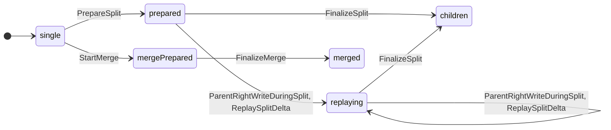
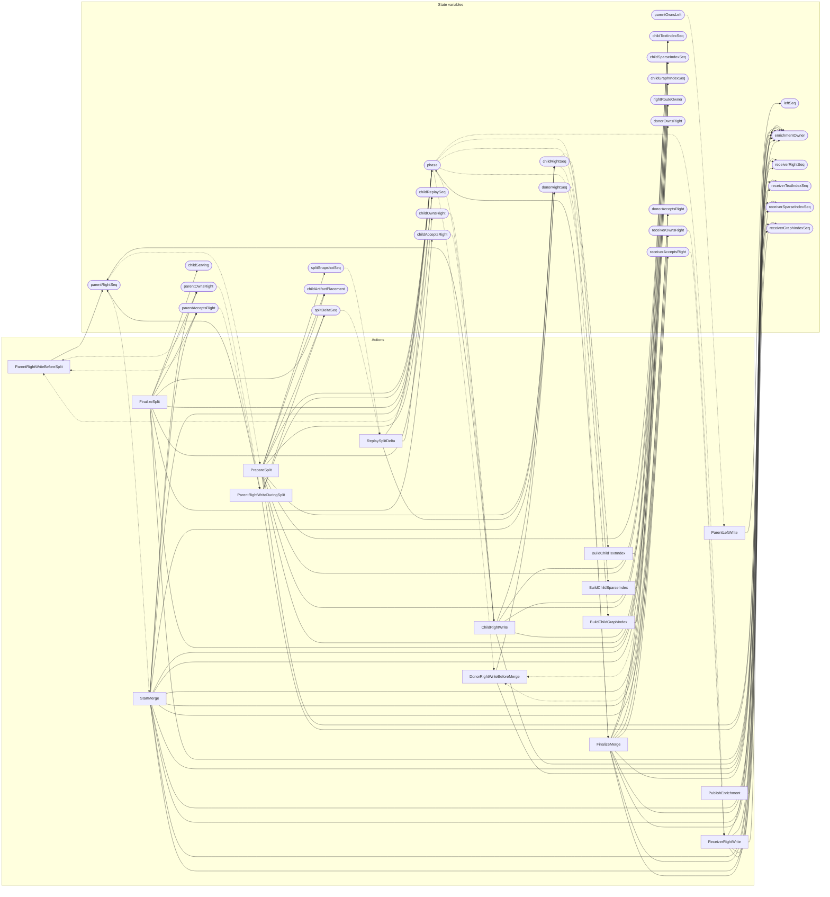

<!-- GENERATED FILE: do not edit. Regenerate with `make -C zig tla-viz` (scripts/tla-viz/gen_structural.py). -->

# AntflyDbSplitVisibility — structural diagrams

Generated from [`AntflyDbSplitVisibility.tla`](../../../storage/db/AntflyDbSplitVisibility.tla). 30 state variables, 15 actions in `Next`. 4 expected-failure mutant action(s) (gated by `Buggy*` constants) omitted.

## Phase state machines

Transitions are extracted from action guards and primed updates; edge labels are the actions that perform the transition.

### `phase`

### `childArtifactPlacement`

Domain: `none`, `local`, `remote`. No statically extractable guard/update transitions.

Writes whose source state is not statically determined:

- `FinalizeSplit` sets `childArtifactPlacement` to `"remote"`
- `PrepareSplit` sets `childArtifactPlacement` to `"local"`

### `rightRouteOwner`

Domain: `none`, `parent`, `child`, `donor`, `receiver`. No statically extractable guard/update transitions.

Writes whose source state is not statically determined:

- `FinalizeMerge` sets `rightRouteOwner` to `"receiver"`
- `FinalizeSplit` sets `rightRouteOwner` to `"child"`
- `PrepareSplit` sets `rightRouteOwner` to `"parent"`
- `StartMerge` sets `rightRouteOwner` to `"donor"`

### `enrichmentOwner`

Domain: `none`, `parent`, `child`, `donor`, `receiver`. No statically extractable guard/update transitions.

Writes whose source state is not statically determined:

- `ChildRightWrite` sets `enrichmentOwner` to `"none"`
- `DonorRightWriteBeforeMerge` sets `enrichmentOwner` to `"none"`
- `FinalizeMerge` sets `enrichmentOwner` to `"none"`
- `FinalizeSplit` sets `enrichmentOwner` to `"none"`
- `ParentRightWriteDuringSplit` sets `enrichmentOwner` to `"none"`
- `PrepareSplit` sets `enrichmentOwner` to `"none"`
- `ReceiverRightWrite` sets `enrichmentOwner` to `"none"`
- `StartMerge` sets `enrichmentOwner` to `"none"`

## Actions and the state they touch

| Action | Reads (incl. helper operators) | Writes |
| --- | --- | --- |
| `ParentLeftWrite` | `leftSeq`, `parentOwnsLeft` | `leftSeq` |
| `ParentRightWriteBeforeSplit` | `phase`, `parentRightSeq`, `parentOwnsRight`, `parentAcceptsRight` | `parentRightSeq` |
| `PrepareSplit` | `phase`, `parentRightSeq` | `phase`, `splitSnapshotSeq`, `splitDeltaSeq`, `childReplaySeq`, `childRightSeq`, `childTextIndexSeq`, `childSparseIndexSeq`, `childGraphIndexSeq`, `childArtifactPlacement`, `rightRouteOwner`, `enrichmentOwner` |
| `ParentRightWriteDuringSplit` | `phase`, `parentRightSeq`, `splitDeltaSeq`, `parentOwnsRight`, `parentAcceptsRight` | `phase`, `parentRightSeq`, `splitDeltaSeq`, `enrichmentOwner` |
| `ReplaySplitDelta` | `phase`, `splitSnapshotSeq`, `splitDeltaSeq`, `childReplaySeq` | `phase`, `childReplaySeq`, `childRightSeq` |
| `BuildChildTextIndex` | `phase`, `childRightSeq`, `childTextIndexSeq` | `childTextIndexSeq` |
| `BuildChildSparseIndex` | `phase`, `childRightSeq`, `childSparseIndexSeq` | `childSparseIndexSeq` |
| `BuildChildGraphIndex` | `phase`, `childRightSeq`, `childGraphIndexSeq` | `childGraphIndexSeq` |
| `FinalizeSplit` | `phase`, `parentRightSeq`, `splitDeltaSeq`, `childReplaySeq`, `childRightSeq`, `childTextIndexSeq`, `childSparseIndexSeq`, `childGraphIndexSeq` | `phase`, `childArtifactPlacement`, `childServing`, `parentOwnsRight`, `childOwnsRight`, `parentAcceptsRight`, `childAcceptsRight`, `rightRouteOwner`, `enrichmentOwner` |
| `ChildRightWrite` | `phase`, `parentRightSeq`, `childRightSeq`, `childOwnsRight`, `childAcceptsRight` | `parentRightSeq`, `childRightSeq`, `childTextIndexSeq`, `childSparseIndexSeq`, `childGraphIndexSeq`, `enrichmentOwner` |
| `StartMerge` | `phase`, `parentRightSeq` | `phase`, `parentOwnsRight`, `donorOwnsRight`, `receiverOwnsRight`, `parentAcceptsRight`, `donorAcceptsRight`, `receiverAcceptsRight`, `donorRightSeq`, `receiverRightSeq`, `receiverTextIndexSeq`, `receiverSparseIndexSeq`, `receiverGraphIndexSeq`, `rightRouteOwner`, `enrichmentOwner` |
| `DonorRightWriteBeforeMerge` | `phase`, `donorOwnsRight`, `donorAcceptsRight`, `donorRightSeq` | `donorRightSeq`, `enrichmentOwner` |
| `FinalizeMerge` | `phase`, `donorRightSeq` | `phase`, `donorOwnsRight`, `receiverOwnsRight`, `donorAcceptsRight`, `receiverAcceptsRight`, `receiverRightSeq`, `receiverTextIndexSeq`, `receiverSparseIndexSeq`, `receiverGraphIndexSeq`, `rightRouteOwner`, `enrichmentOwner` |
| `ReceiverRightWrite` | `phase`, `receiverOwnsRight`, `receiverAcceptsRight`, `receiverRightSeq` | `receiverRightSeq`, `receiverTextIndexSeq`, `receiverSparseIndexSeq`, `receiverGraphIndexSeq`, `enrichmentOwner` |
| `PublishEnrichment` | `phase` | `enrichmentOwner` |

## Write graph

Solid edges: the action updates the variable. Dotted edges: the action's own definition reads the variable (reads via helper operators appear in the table above, not here).

