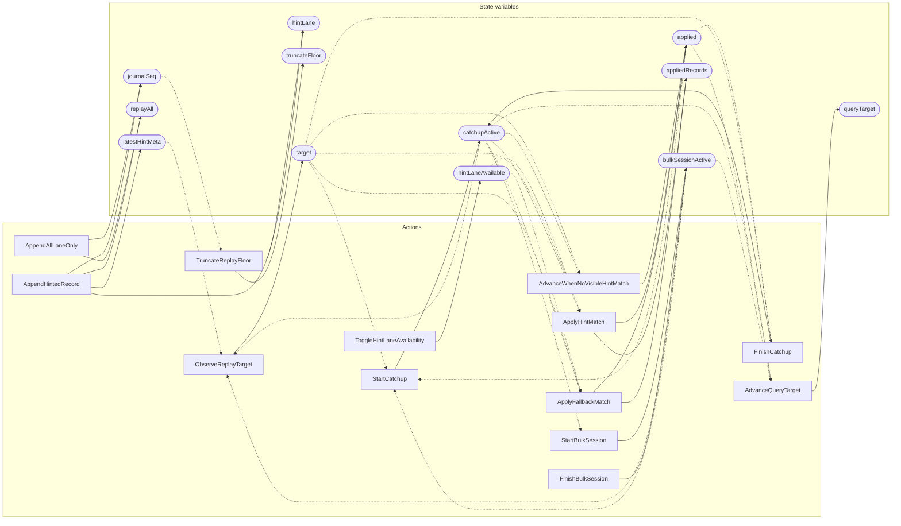

<!-- GENERATED FILE: do not edit. Regenerate with `make -C zig tla-viz` (scripts/tla-viz/gen_structural.py). -->

# AntflyDerivedReplay — structural diagrams

Generated from [`AntflyDerivedReplay.tla`](../../../storage/db/AntflyDerivedReplay.tla). 12 state variables, 13 actions in `Next`. 1 expected-failure mutant action(s) (gated by `Buggy*` constants) omitted.

## Actions and the state they touch

| Action | Reads (incl. helper operators) | Writes |
| --- | --- | --- |
| `TruncateReplayFloor` | `journalSeq`, `replayAll`, `hintLane`, `latestHintMeta`, `truncateFloor`, `appliedRecords` | `hintLane`, `truncateFloor` |
| `AppendAllLaneOnly` | `journalSeq`, `replayAll` | `journalSeq`, `replayAll` |
| `AppendHintedRecord` | `journalSeq`, `replayAll`, `hintLane`, `latestHintMeta` | `journalSeq`, `replayAll`, `hintLane`, `latestHintMeta` |
| `ToggleHintLaneAvailability` | `hintLaneAvailable` | `hintLaneAvailable` |
| `StartBulkSession` | `catchupActive`, `bulkSessionActive` | `bulkSessionActive` |
| `FinishBulkSession` | `bulkSessionActive` | `bulkSessionActive` |
| `ObserveReplayTarget` | `latestHintMeta`, `target`, `catchupActive`, `bulkSessionActive` | `target` |
| `StartCatchup` | `applied`, `target`, `catchupActive`, `bulkSessionActive` | `catchupActive` |
| `AdvanceWhenNoVisibleHintMatch` | `replayAll`, `truncateFloor`, `applied`, `target`, `catchupActive` | `applied` |
| `FinishCatchup` | `applied`, `target`, `catchupActive` | `catchupActive` |
| `AdvanceQueryTarget` | `applied`, `queryTarget`, `catchupActive`, `bulkSessionActive` | `queryTarget` |
| `ApplyHintMatch` | `replayAll`, `hintLane`, `hintLaneAvailable`, `truncateFloor`, `applied`, `appliedRecords`, `target`, `catchupActive` | `applied`, `appliedRecords` |
| `ApplyFallbackMatch` | `replayAll`, `hintLane`, `hintLaneAvailable`, `truncateFloor`, `applied`, `appliedRecords`, `target`, `catchupActive` | `applied`, `appliedRecords` |

## Write graph

Solid edges: the action updates the variable. Dotted edges: the action's own definition reads the variable (reads via helper operators appear in the table above, not here).

