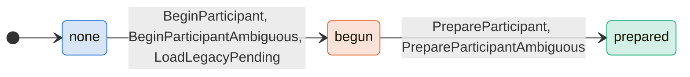
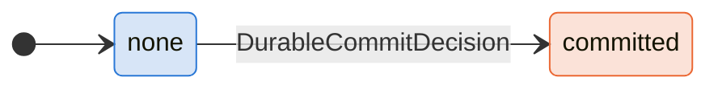
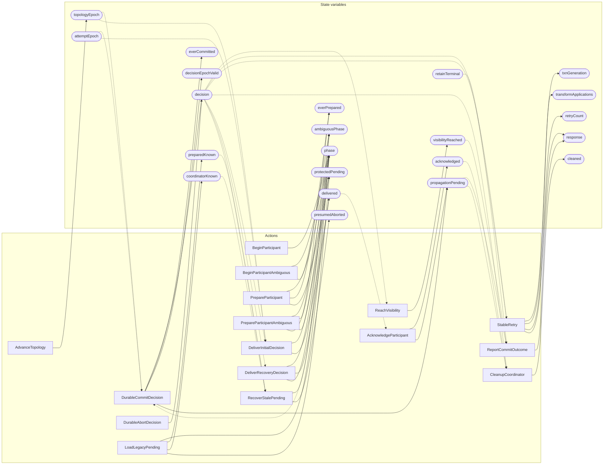

<!-- GENERATED FILE: do not edit. Regenerate with `make -C zig tla-viz` (scripts/tla-viz/gen_structural.py). -->

# AntflyDistributedTransactionRecovery — structural diagrams

Generated from [`AntflyDistributedTransactionRecovery.tla`](../../../storage/db/AntflyDistributedTransactionRecovery.tla). 22 state variables, 16 actions in `Next`.

## Phase state machines

Transitions are extracted from action guards and primed updates; edge labels are the actions that perform the transition.

### `phase`

Writes whose source state is not statically determined:

- `RecoverStalePending` sets `phase` to `"aborted"`

### `ambiguousPhase`

Domain: `none`, `begin`, `prepare`, `resolve`. No statically extractable guard/update transitions.

Writes whose source state is not statically determined:

- `BeginParticipantAmbiguous` sets `ambiguousPhase` to `"begin"`
- `DeliverRecoveryDecision` sets `ambiguousPhase` to `"resolve"`
- `PrepareParticipantAmbiguous` sets `ambiguousPhase` to `"prepare"`

### `decision`

Writes whose source state is not statically determined:

- `DurableAbortDecision` sets `decision` to `"aborted"`

### `response`

Domain: `none`, `committed`, `committed_visibility_pending`, `committed_recovery_pending`. No statically extractable guard/update transitions.

## Actions and the state they touch

| Action | Reads (incl. helper operators) | Writes |
| --- | --- | --- |
| `DurableCommitDecision` | `topologyEpoch`, `attemptEpoch`, `phase`, `decision` | `decision`, `everCommitted`, `decisionEpochValid`, `propagationPending` |
| `DurableAbortDecision` | `decision` | `decision` |
| `AdvanceTopology` | `topologyEpoch` | `topologyEpoch` |
| `ReachVisibility` | `decision` | `visibilityReached` |
| `ReportCommitOutcome` | `decision`, `propagationPending`, `visibilityReached` | `response` |
| `StableRetry` | `txnGeneration`, `transformApplications`, `retryCount`, `decision`, `retainTerminal`, `propagationPending`, `visibilityReached` | `txnGeneration`, `transformApplications`, `retryCount`, `response` |
| `CleanupCoordinator` | `acknowledged`, `decision`, `propagationPending` | `cleaned` |
| `BeginParticipant` | `phase` | `phase` |
| `BeginParticipantAmbiguous` | `phase`, `ambiguousPhase` | `phase`, `ambiguousPhase` |
| `PrepareParticipant` | `phase`, `everPrepared`, `protectedPending` | `phase`, `everPrepared`, `protectedPending` |
| `PrepareParticipantAmbiguous` | `phase`, `everPrepared`, `protectedPending`, `ambiguousPhase` | `phase`, `everPrepared`, `protectedPending`, `ambiguousPhase` |
| `LoadLegacyPending` | `phase`, `preparedKnown`, `coordinatorKnown`, `protectedPending` | `phase`, `preparedKnown`, `coordinatorKnown`, `protectedPending` |
| `DeliverInitialDecision` | `topologyEpoch`, `attemptEpoch`, `phase`, `delivered`, `decision` | `phase`, `delivered` |
| `DeliverRecoveryDecision` | `phase`, `delivered`, `ambiguousPhase`, `decision` | `phase`, `delivered`, `ambiguousPhase` |
| `RecoverStalePending` | `phase`, `preparedKnown`, `coordinatorKnown`, `presumedAborted`, `decision` | `phase`, `presumedAborted` |
| `AcknowledgeParticipant` | `delivered`, `acknowledged` | `acknowledged`, `propagationPending` |

## Write graph

Solid edges: the action updates the variable. Dotted edges: the action's own definition reads the variable (reads via helper operators appear in the table above, not here).

