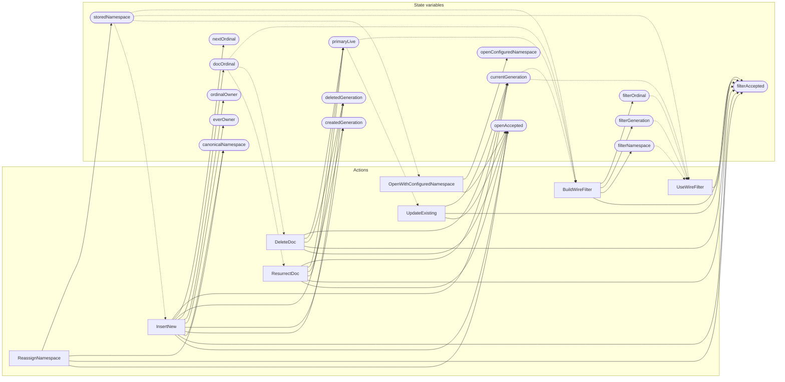

<!-- GENERATED FILE: do not edit. Regenerate with `make -C zig tla-viz` (scripts/tla-viz/gen_structural.py). -->

# AntflyDocumentIdentity — structural diagrams

Generated from [`AntflyDocumentIdentity.tla`](../../../storage/db/AntflyDocumentIdentity.tla). 16 state variables, 8 actions in `Next`. 3 expected-failure mutant action(s) (gated by `Buggy*` constants) omitted.

## Actions and the state they touch

| Action | Reads (incl. helper operators) | Writes |
| --- | --- | --- |
| `ReassignNamespace` | `createdGeneration`, `storedNamespace`, `canonicalNamespace` | `storedNamespace`, `canonicalNamespace`, `filterAccepted`, `openAccepted` |
| `BuildWireFilter` | `currentGeneration`, `primaryLive`, `docOrdinal`, `storedNamespace` | `filterOrdinal`, `filterGeneration`, `filterNamespace`, `filterAccepted` |
| `UseWireFilter` | `currentGeneration`, `createdGeneration`, `deletedGeneration`, `storedNamespace`, `filterOrdinal`, `filterGeneration`, `filterNamespace` | `filterAccepted` |
| `OpenWithConfiguredNamespace` | `storedNamespace` | `openConfiguredNamespace`, `openAccepted` |
| `InsertNew` | `currentGeneration`, `nextOrdinal`, `primaryLive`, `docOrdinal`, `ordinalOwner`, `everOwner`, `createdGeneration`, `deletedGeneration`, `storedNamespace`, `canonicalNamespace` | `currentGeneration`, `nextOrdinal`, `primaryLive`, `docOrdinal`, `ordinalOwner`, `everOwner`, `createdGeneration`, `deletedGeneration`, `canonicalNamespace`, `filterAccepted`, `openAccepted` |
| `UpdateExisting` | `currentGeneration`, `primaryLive` | `currentGeneration`, `filterAccepted`, `openAccepted` |
| `DeleteDoc` | `currentGeneration`, `primaryLive`, `docOrdinal`, `deletedGeneration` | `currentGeneration`, `primaryLive`, `deletedGeneration`, `filterAccepted`, `openAccepted` |
| `ResurrectDoc` | `currentGeneration`, `primaryLive`, `docOrdinal`, `createdGeneration`, `deletedGeneration` | `currentGeneration`, `primaryLive`, `createdGeneration`, `deletedGeneration`, `filterAccepted`, `openAccepted` |

## Write graph

Solid edges: the action updates the variable. Dotted edges: the action's own definition reads the variable (reads via helper operators appear in the table above, not here).

