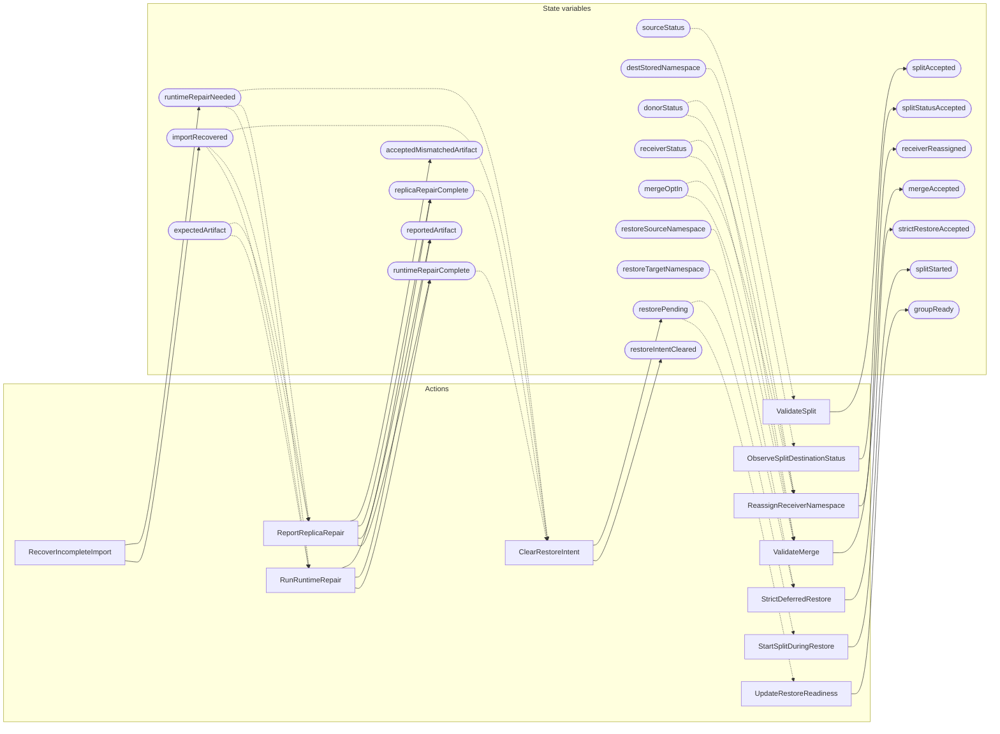

<!-- GENERATED FILE: do not edit. Regenerate with `make -C zig tla-viz` (scripts/tla-viz/gen_structural.py). -->

# AntflyDocumentIdentityRangeRepair — structural diagrams

Generated from [`AntflyDocumentIdentityRangeRepair.tla`](../../../storage/db/AntflyDocumentIdentityRangeRepair.tla). 23 state variables, 11 actions in `Next`.

## Phase state machines

Transitions are extracted from action guards and primed updates; edge labels are the actions that perform the transition.

### `sourceStatus`

Domain: `healthyA`, `healthyB`, `oldNoRows`, `active`, `conflict`, `rebuild`, `exhausted`. No statically extractable guard/update transitions.

### `donorStatus`

Domain: `healthyA`, `healthyB`, `oldNoRows`, `active`, `conflict`, `rebuild`, `exhausted`. No statically extractable guard/update transitions.

### `receiverStatus`

Domain: `healthyA`, `healthyB`, `oldNoRows`, `active`, `conflict`, `rebuild`, `exhausted`. No statically extractable guard/update transitions.

### `expectedArtifact`

Domain: `bound`, `other`, `none`. No statically extractable guard/update transitions.

### `reportedArtifact`

Domain: `bound`, `other`, `none`. No statically extractable guard/update transitions.

## Actions and the state they touch

| Action | Reads (incl. helper operators) | Writes |
| --- | --- | --- |
| `ValidateSplit` | `sourceStatus` | `splitAccepted` |
| `ObserveSplitDestinationStatus` | `destStoredNamespace` | `splitStatusAccepted` |
| `ValidateMerge` | `donorStatus`, `receiverStatus`, `mergeOptIn` | `mergeAccepted` |
| `ReassignReceiverNamespace` | `donorStatus`, `receiverStatus`, `mergeOptIn` | `receiverReassigned` |
| `StrictDeferredRestore` | `restoreSourceNamespace`, `restoreTargetNamespace` | `strictRestoreAccepted` |
| `RecoverIncompleteImport` | — | `importRecovered`, `runtimeRepairNeeded` |
| `RunRuntimeRepair` | `importRecovered`, `runtimeRepairNeeded`, `expectedArtifact`, `reportedArtifact`, `replicaRepairComplete` | `runtimeRepairComplete`, `reportedArtifact`, `replicaRepairComplete` |
| `ReportReplicaRepair` | `importRecovered`, `runtimeRepairNeeded`, `runtimeRepairComplete`, `expectedArtifact`, `reportedArtifact`, `replicaRepairComplete`, `acceptedMismatchedArtifact` | `runtimeRepairComplete`, `reportedArtifact`, `replicaRepairComplete`, `acceptedMismatchedArtifact` |
| `ClearRestoreIntent` | `importRecovered`, `runtimeRepairNeeded`, `runtimeRepairComplete`, `replicaRepairComplete` | `restoreIntentCleared`, `restorePending` |
| `UpdateRestoreReadiness` | `restorePending`, `groupReady` | `groupReady` |
| `StartSplitDuringRestore` | `restorePending`, `splitStarted` | `splitStarted` |

## Write graph

Solid edges: the action updates the variable. Dotted edges: the action's own definition reads the variable (reads via helper operators appear in the table above, not here).

