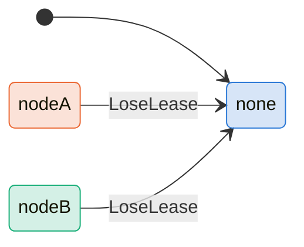
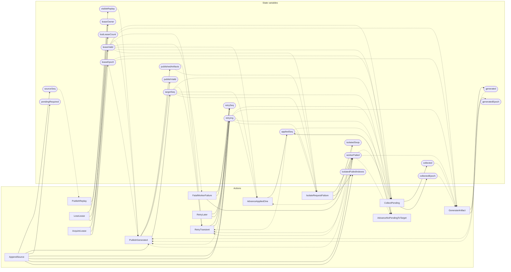

<!-- GENERATED FILE: do not edit. Regenerate with `make -C zig tla-viz` (scripts/tla-viz/gen_structural.py). -->

# AntflyEnrichmentLease — structural diagrams

Generated from [`AntflyEnrichmentLease.tla`](../../../storage/db/AntflyEnrichmentLease.tla). 20 state variables, 13 actions in `Next`. 2 expected-failure mutant action(s) (gated by `Buggy*` constants) omitted.

## Phase state machines

Transitions are extracted from action guards and primed updates; edge labels are the actions that perform the transition.

### `leaseOwner`

## Actions and the state they touch

| Action | Reads (incl. helper operators) | Writes |
| --- | --- | --- |
| `AppendSource` | `sourceSeq`, `pendingRequired` | `sourceSeq`, `targetSeq`, `pendingRequired`, `retrying`, `retrySeq`, `workerFailed`, `isolatedFailedIndexes` |
| `PublishReplay` | `sourceSeq`, `visibleReplay` | `visibleReplay` |
| `CollectPending` | `leaseValid`, `leaseEpoch`, `targetSeq`, `appliedSeq`, `visibleReplay`, `pendingRequired`, `collected`, `collectedEpoch`, `retrying`, `workerFailed` | `collected`, `collectedEpoch` |
| `GenerateArtifact` | `leaseValid`, `leaseEpoch`, `collected`, `collectedEpoch`, `generated`, `generatedEpoch`, `retrying`, `workerFailed` | `generated`, `generatedEpoch` |
| `PublishGenerated` | `leaseValid`, `leaseEpoch`, `visibleReplay`, `generated`, `generatedEpoch`, `publishedArtifacts`, `publishValid`, `retrying`, `workerFailed` | `publishedArtifacts`, `publishValid` |
| `RetryTransient` | `leaseValid`, `targetSeq`, `appliedSeq`, `visibleReplay`, `pendingRequired`, `publishedArtifacts`, `retrying`, `workerFailed`, `isolatedSeqs` | `retrying`, `retrySeq` |
| `RetryLater` | `retrying` | `retrying`, `retrySeq` |
| `LoseLease` | `leaseOwner`, `leaseValid`, `lostLeaseCount` | `leaseOwner`, `leaseValid`, `lostLeaseCount` |
| `FatalWorkerFailure` | `leaseValid`, `workerFailed` | `retrying`, `retrySeq`, `workerFailed` |
| `AdvanceAppliedOne` | `leaseValid`, `targetSeq`, `appliedSeq`, `visibleReplay`, `pendingRequired`, `publishedArtifacts`, `retrying`, `workerFailed`, `isolatedSeqs` | `appliedSeq` |
| `AdvanceNoPendingToTarget` | `leaseValid`, `targetSeq`, `appliedSeq`, `pendingRequired`, `retrying`, `workerFailed` | `appliedSeq` |
| `AcquireLease` | `leaseOwner`, `leaseValid`, `leaseEpoch` | `leaseOwner`, `leaseValid`, `leaseEpoch` |
| `IsolateRequestFailure` | `leaseValid`, `targetSeq`, `appliedSeq`, `visibleReplay`, `pendingRequired`, `publishedArtifacts`, `retrying`, `isolatedFailedIndexes`, `isolatedSeqs` | `workerFailed`, `isolatedFailedIndexes`, `isolatedSeqs` |

## Write graph

Solid edges: the action updates the variable. Dotted edges: the action's own definition reads the variable (reads via helper operators appear in the table above, not here).

