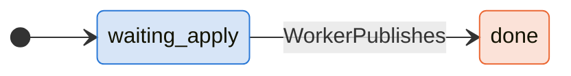
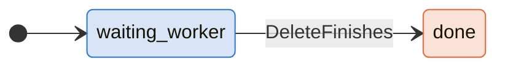
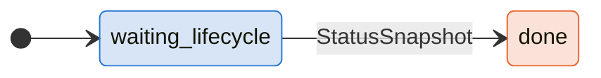
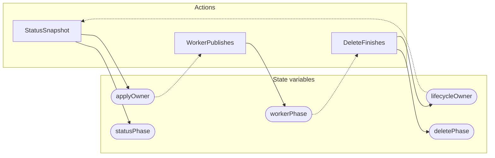

<!-- GENERATED FILE: do not edit. Regenerate with `make -C zig tla-viz` (scripts/tla-viz/gen_structural.py). -->

# AntflyEnrichmentLifecycleLockOrder — structural diagrams

Generated from [`AntflyEnrichmentLifecycleLockOrder.tla`](../../../storage/db/AntflyEnrichmentLifecycleLockOrder.tla). 5 state variables, 3 actions in `Next`.

## Phase state machines

Transitions are extracted from action guards and primed updates; edge labels are the actions that perform the transition.

### `applyOwner`

Domain: `none`, `status`. No statically extractable guard/update transitions.

Writes whose source state is not statically determined:

- `StatusSnapshot` sets `applyOwner` to `"none"`

### `lifecycleOwner`

Domain: `none`, `delete`. No statically extractable guard/update transitions.

Writes whose source state is not statically determined:

- `DeleteFinishes` sets `lifecycleOwner` to `"none"`

### `workerPhase`

### `deletePhase`

### `statusPhase`

## Actions and the state they touch

| Action | Reads (incl. helper operators) | Writes |
| --- | --- | --- |
| `StatusSnapshot` | `lifecycleOwner`, `statusPhase` | `applyOwner`, `statusPhase` |
| `WorkerPublishes` | `applyOwner`, `workerPhase` | `workerPhase` |
| `DeleteFinishes` | `workerPhase`, `deletePhase` | `lifecycleOwner`, `deletePhase` |

## Write graph

Solid edges: the action updates the variable. Dotted edges: the action's own definition reads the variable (reads via helper operators appear in the table above, not here).

