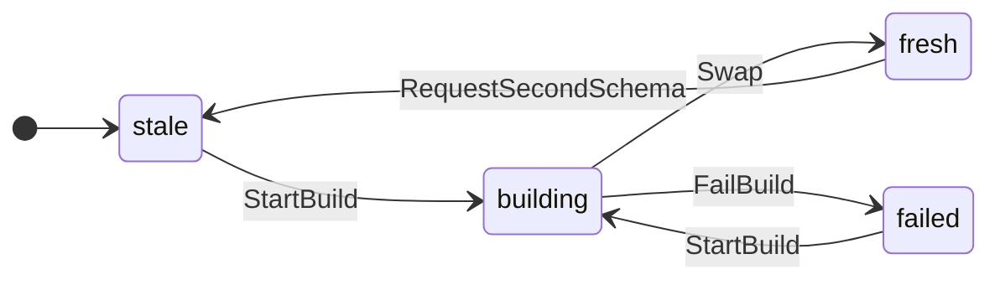
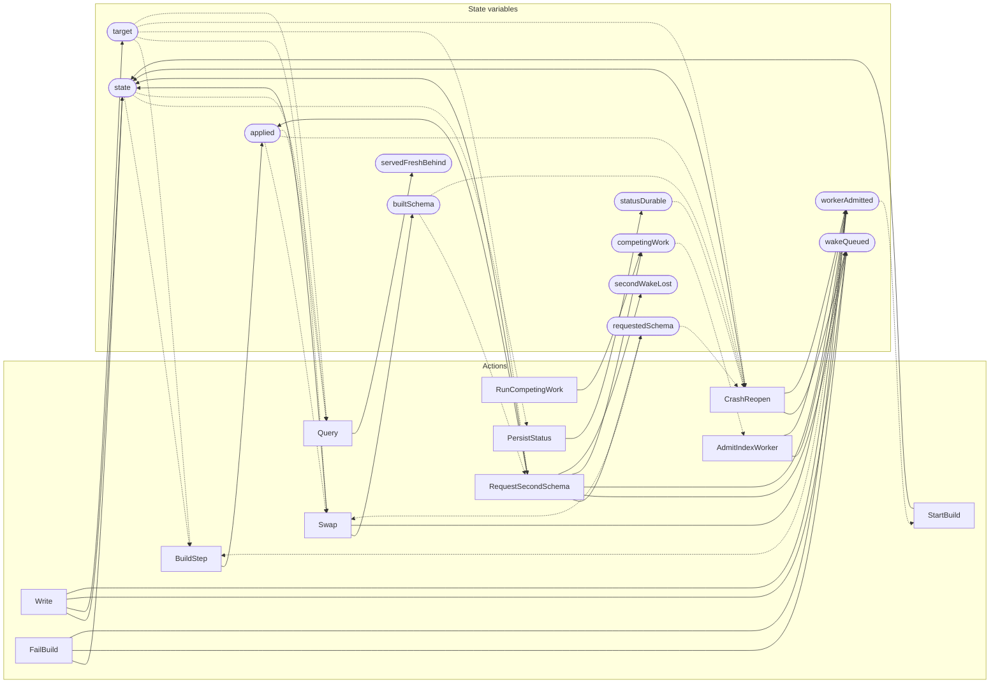

<!-- GENERATED FILE: do not edit. Regenerate with `make -C zig tla-viz` (scripts/tla-viz/gen_structural.py). -->

# AntflyIndexLifecycle — structural diagrams

Generated from [`AntflyIndexLifecycle.tla`](../../../storage/db/AntflyIndexLifecycle.tla). 11 state variables, 11 actions in `Next`.

## Phase state machines

Transitions are extracted from action guards and primed updates; edge labels are the actions that perform the transition.

### `state`

Writes whose source state is not statically determined:

- `CrashReopen` sets `state` to `"fresh"`
- `CrashReopen` sets `state` to `"stale"`
- `Write` sets `state` to `"building"`
- `Write` sets `state` to `"fresh"`

### `statusDurable`

Domain: `stale`, `building`, `fresh`, `failed`. No statically extractable guard/update transitions.

## Actions and the state they touch

| Action | Reads (incl. helper operators) | Writes |
| --- | --- | --- |
| `Write` | `state`, `target`, `wakeQueued`, `workerAdmitted` | `state`, `target`, `wakeQueued`, `workerAdmitted` |
| `RunCompetingWork` | `competingWork` | `competingWork` |
| `AdmitIndexWorker` | `wakeQueued`, `workerAdmitted`, `competingWork` | `wakeQueued`, `workerAdmitted` |
| `StartBuild` | `state`, `workerAdmitted` | `state` |
| `BuildStep` | `state`, `applied`, `target`, `workerAdmitted` | `applied` |
| `Swap` | `state`, `applied`, `target`, `requestedSchema` | `state`, `builtSchema`, `workerAdmitted` |
| `FailBuild` | `state` | `state`, `wakeQueued`, `workerAdmitted` |
| `RequestSecondSchema` | `state`, `target`, `requestedSchema`, `builtSchema` | `state`, `applied`, `requestedSchema`, `wakeQueued`, `workerAdmitted`, `competingWork`, `secondWakeLost` |
| `PersistStatus` | `state`, `statusDurable` | `statusDurable` |
| `CrashReopen` | `applied`, `target`, `statusDurable`, `requestedSchema`, `builtSchema`, `wakeQueued` | `state`, `wakeQueued`, `workerAdmitted` |
| `Query` | `state`, `applied`, `target`, `servedFreshBehind` | `servedFreshBehind` |

## Write graph

Solid edges: the action updates the variable. Dotted edges: the action's own definition reads the variable (reads via helper operators appear in the table above, not here).

