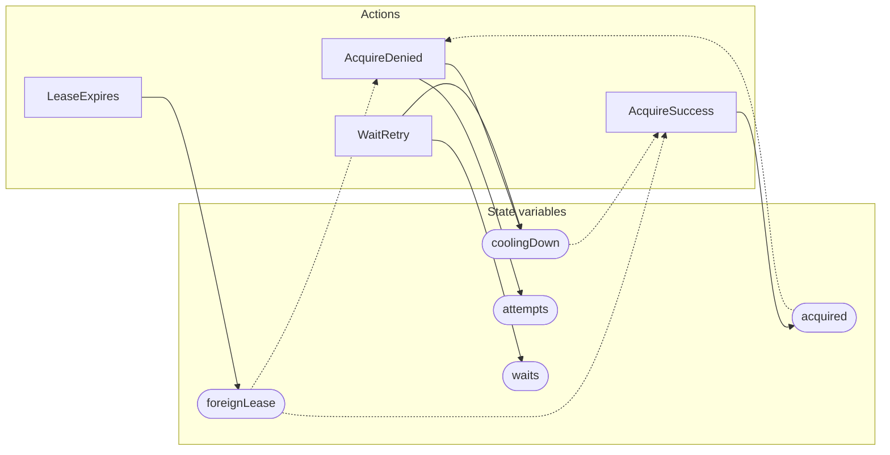

<!-- GENERATED FILE: do not edit. Regenerate with `make -C zig tla-viz` (scripts/tla-viz/gen_structural.py). -->

# AntflyLeaseRetryBackoff — structural diagrams

Generated from [`AntflyLeaseRetryBackoff.tla`](../../../storage/db/AntflyLeaseRetryBackoff.tla). 5 state variables, 4 actions in `Next`.

## Actions and the state they touch

| Action | Reads (incl. helper operators) | Writes |
| --- | --- | --- |
| `AcquireDenied` | `foreignLease`, `coolingDown`, `attempts`, `acquired` | `coolingDown`, `attempts` |
| `WaitRetry` | `coolingDown`, `waits` | `coolingDown`, `waits` |
| `LeaseExpires` | `foreignLease` | `foreignLease` |
| `AcquireSuccess` | `foreignLease`, `coolingDown`, `acquired` | `acquired` |

## Write graph

Solid edges: the action updates the variable. Dotted edges: the action's own definition reads the variable (reads via helper operators appear in the table above, not here).

