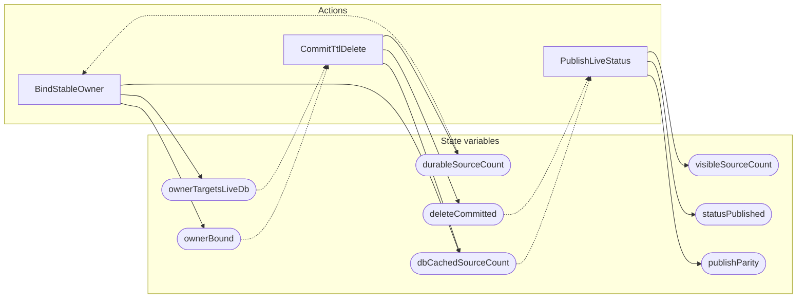

<!-- GENERATED FILE: do not edit. Regenerate with `make -C zig tla-viz` (scripts/tla-viz/gen_structural.py). -->

# AntflyLiveSourceCardinality — structural diagrams

Generated from [`AntflyLiveSourceCardinality.tla`](../../../storage/db/AntflyLiveSourceCardinality.tla). 8 state variables, 3 actions in `Next`.

## Actions and the state they touch

| Action | Reads (incl. helper operators) | Writes |
| --- | --- | --- |
| `BindStableOwner` | `durableSourceCount`, `dbCachedSourceCount`, `ownerBound` | `dbCachedSourceCount`, `ownerBound`, `ownerTargetsLiveDb` |
| `CommitTtlDelete` | `dbCachedSourceCount`, `ownerBound`, `ownerTargetsLiveDb`, `deleteCommitted` | `durableSourceCount`, `dbCachedSourceCount`, `deleteCommitted` |
| `PublishLiveStatus` | `dbCachedSourceCount`, `visibleSourceCount`, `deleteCommitted`, `statusPublished`, `publishParity` | `visibleSourceCount`, `statusPublished`, `publishParity` |

## Write graph

Solid edges: the action updates the variable. Dotted edges: the action's own definition reads the variable (reads via helper operators appear in the table above, not here).

