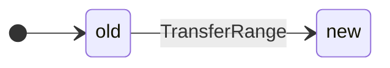
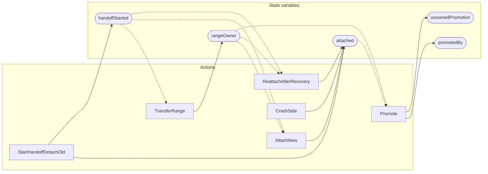

<!-- GENERATED FILE: do not edit. Regenerate with `make -C zig tla-viz` (scripts/tla-viz/gen_structural.py). -->

# AntflyPromotionOwnerHandoff — structural diagrams

Generated from [`AntflyPromotionOwnerHandoff.tla`](../../../storage/db/AntflyPromotionOwnerHandoff.tla). 5 state variables, 6 actions in `Next`.

## Phase state machines

Transitions are extracted from action guards and primed updates; edge labels are the actions that perform the transition.

### `rangeOwner`

## Actions and the state they touch

| Action | Reads (incl. helper operators) | Writes |
| --- | --- | --- |
| `StartHandoffDetachOld` | `attached`, `handoffStarted` | `attached`, `handoffStarted` |
| `TransferRange` | `rangeOwner`, `handoffStarted` | `rangeOwner` |
| `AttachNew` | `rangeOwner`, `attached`, `handoffStarted` | `attached` |
| `CrashSide` | `attached` | `attached` |
| `ReattachAfterRecovery` | `rangeOwner`, `attached`, `handoffStarted` | `attached` |
| `Promote` | `rangeOwner`, `attached`, `promotedBy`, `unownedPromotion` | `promotedBy`, `unownedPromotion` |

## Write graph

Solid edges: the action updates the variable. Dotted edges: the action's own definition reads the variable (reads via helper operators appear in the table above, not here).

