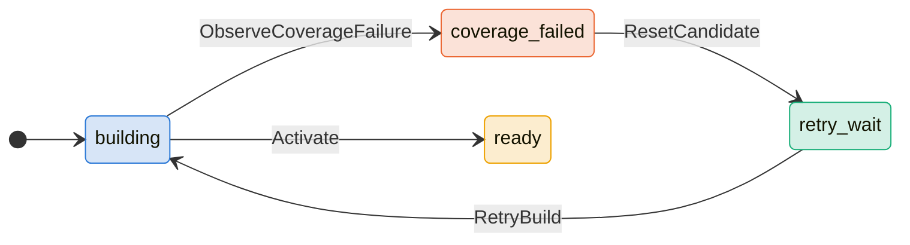
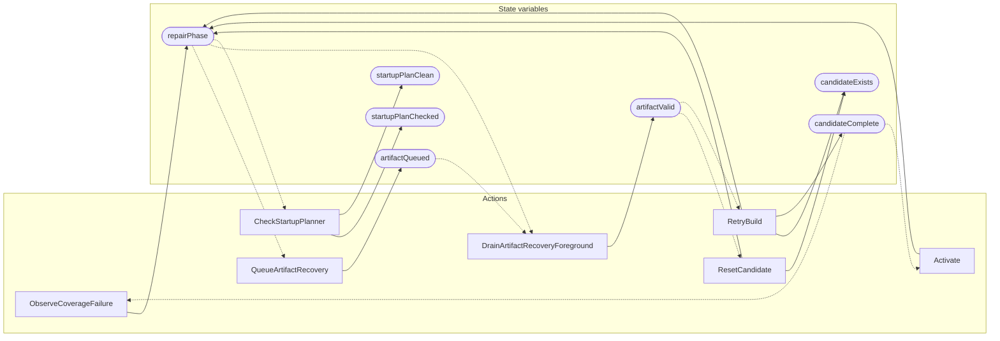

<!-- GENERATED FILE: do not edit. Regenerate with `make -C zig tla-viz` (scripts/tla-viz/gen_structural.py). -->

# AntflyRepairArtifactRecovery — structural diagrams

Generated from [`AntflyRepairArtifactRecovery.tla`](../../../storage/db/AntflyRepairArtifactRecovery.tla). 7 state variables, 7 actions in `Next`.

## Phase state machines

Transitions are extracted from action guards and primed updates; edge labels are the actions that perform the transition.

### `repairPhase`

## Actions and the state they touch

| Action | Reads (incl. helper operators) | Writes |
| --- | --- | --- |
| `ObserveCoverageFailure` | `candidateComplete`, `repairPhase` | `repairPhase` |
| `QueueArtifactRecovery` | `artifactQueued`, `repairPhase` | `artifactQueued` |
| `DrainArtifactRecoveryForeground` | `artifactQueued`, `artifactValid`, `repairPhase` | `artifactValid` |
| `ResetCandidate` | `artifactValid`, `repairPhase` | `candidateExists`, `repairPhase` |
| `RetryBuild` | `artifactValid`, `candidateExists`, `candidateComplete`, `repairPhase` | `candidateExists`, `candidateComplete`, `repairPhase` |
| `Activate` | `candidateComplete`, `repairPhase` | `repairPhase` |
| `CheckStartupPlanner` | `repairPhase`, `startupPlanChecked` | `startupPlanChecked`, `startupPlanClean` |

## Write graph

Solid edges: the action updates the variable. Dotted edges: the action's own definition reads the variable (reads via helper operators appear in the table above, not here).

