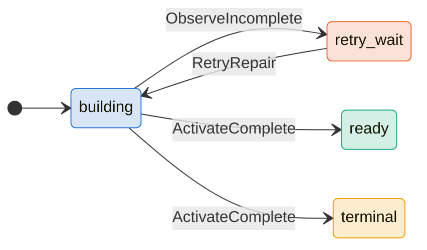
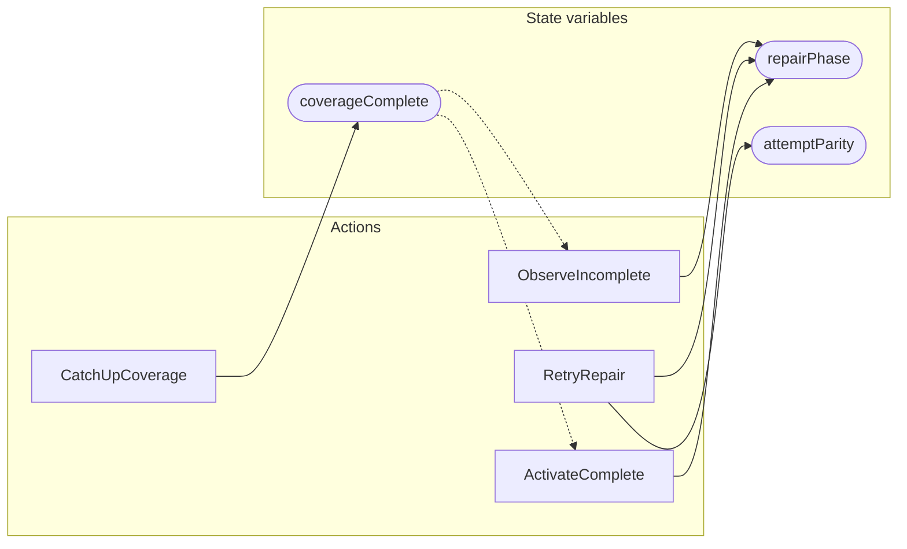

<!-- GENERATED FILE: do not edit. Regenerate with `make -C zig tla-viz` (scripts/tla-viz/gen_structural.py). -->

# AntflyRepairCoverageRetry — structural diagrams

Generated from [`AntflyRepairCoverageRetry.tla`](../../../storage/db/AntflyRepairCoverageRetry.tla). 3 state variables, 4 actions in `Next`.

## Phase state machines

Transitions are extracted from action guards and primed updates; edge labels are the actions that perform the transition.

### `repairPhase`

## Actions and the state they touch

| Action | Reads (incl. helper operators) | Writes |
| --- | --- | --- |
| `ObserveIncomplete` | `coverageComplete`, `repairPhase` | `repairPhase` |
| `CatchUpCoverage` | `coverageComplete` | `coverageComplete` |
| `RetryRepair` | `repairPhase`, `attemptParity` | `repairPhase`, `attemptParity` |
| `ActivateComplete` | `coverageComplete`, `repairPhase` | `repairPhase` |

## Write graph

Solid edges: the action updates the variable. Dotted edges: the action's own definition reads the variable (reads via helper operators appear in the table above, not here).

