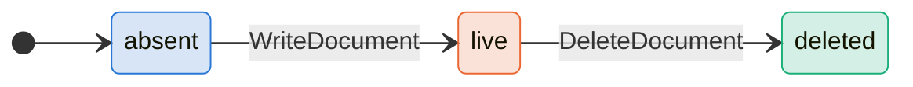
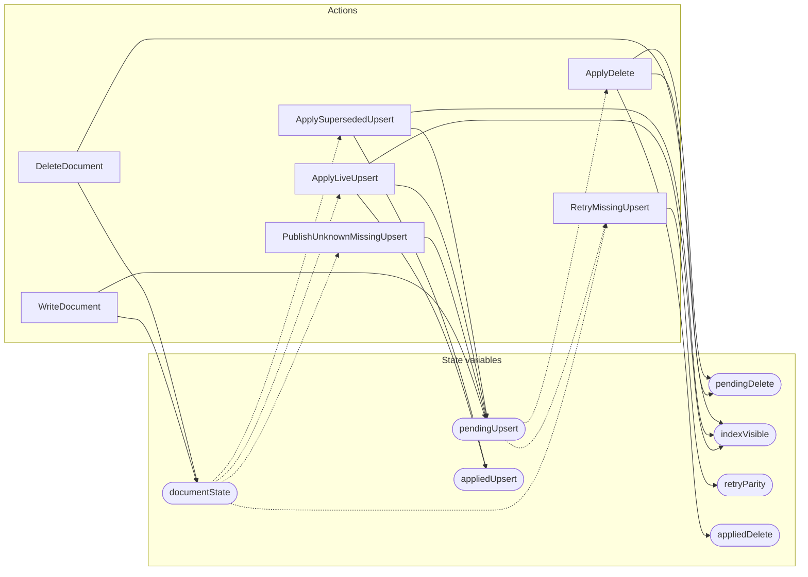

<!-- GENERATED FILE: do not edit. Regenerate with `make -C zig tla-viz` (scripts/tla-viz/gen_structural.py). -->

# AntflyReplayDeleteSupersession — structural diagrams

Generated from [`AntflyReplayDeleteSupersession.tla`](../../../storage/db/AntflyReplayDeleteSupersession.tla). 7 state variables, 7 actions in `Next`.

## Phase state machines

Transitions are extracted from action guards and primed updates; edge labels are the actions that perform the transition.

### `documentState`

## Actions and the state they touch

| Action | Reads (incl. helper operators) | Writes |
| --- | --- | --- |
| `WriteDocument` | `documentState`, `pendingUpsert` | `documentState`, `pendingUpsert` |
| `DeleteDocument` | `documentState`, `pendingDelete` | `documentState`, `pendingDelete` |
| `PublishUnknownMissingUpsert` | `documentState`, `pendingUpsert` | `pendingUpsert` |
| `ApplyLiveUpsert` | `documentState`, `pendingUpsert` | `pendingUpsert`, `indexVisible`, `appliedUpsert` |
| `ApplySupersededUpsert` | `documentState`, `pendingUpsert` | `pendingUpsert`, `indexVisible`, `appliedUpsert` |
| `RetryMissingUpsert` | `documentState`, `pendingUpsert`, `retryParity` | `retryParity` |
| `ApplyDelete` | `pendingUpsert`, `pendingDelete` | `pendingDelete`, `indexVisible`, `appliedDelete` |

## Write graph

Solid edges: the action updates the variable. Dotted edges: the action's own definition reads the variable (reads via helper operators appear in the table above, not here).

