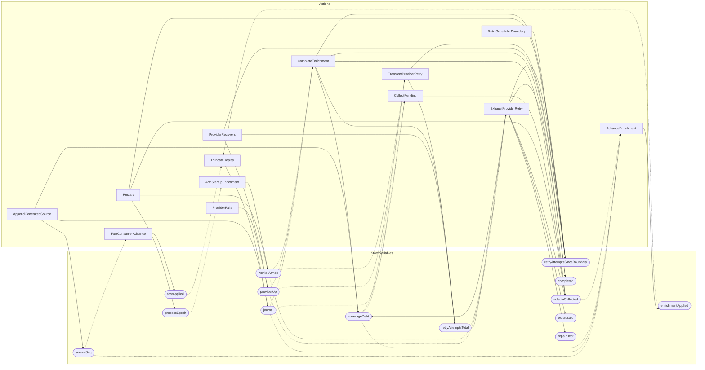

<!-- GENERATED FILE: do not edit. Regenerate with `make -C zig tla-viz` (scripts/tla-viz/gen_structural.py). -->

# AntflyReplayEnrichmentBridge — structural diagrams

Generated from [`AntflyReplayEnrichmentBridge.tla`](../../../storage/db/AntflyReplayEnrichmentBridge.tla). 14 state variables, 13 actions in `Next`.

## Actions and the state they touch

| Action | Reads (incl. helper operators) | Writes |
| --- | --- | --- |
| `AppendGeneratedSource` | `sourceSeq`, `journal`, `coverageDebt` | `sourceSeq`, `journal`, `coverageDebt` |
| `FastConsumerAdvance` | `sourceSeq`, `fastApplied` | `fastApplied` |
| `ProviderFails` | `providerUp` | `providerUp` |
| `ProviderRecovers` | `providerUp` | `providerUp`, `retryAttemptsSinceBoundary`, `retryAttemptsTotal` |
| `TransientProviderRetry` | `coverageDebt`, `providerUp`, `workerArmed`, `retryAttemptsSinceBoundary`, `retryAttemptsTotal` | `retryAttemptsSinceBoundary`, `retryAttemptsTotal` |
| `RetrySchedulerBoundary` | `retryAttemptsSinceBoundary` | `retryAttemptsSinceBoundary` |
| `ExhaustProviderRetry` | `coverageDebt`, `completed`, `volatileCollected`, `providerUp`, `workerArmed`, `retryAttemptsTotal`, `exhausted`, `repairDebt` | `coverageDebt`, `completed`, `volatileCollected`, `retryAttemptsSinceBoundary`, `exhausted`, `repairDebt` |
| `AdvanceEnrichment` | `sourceSeq`, `journal`, `enrichmentApplied`, `coverageDebt`, `volatileCollected` | `enrichmentApplied` |
| `Restart` | `processEpoch` | `volatileCollected`, `workerArmed`, `retryAttemptsSinceBoundary`, `processEpoch` |
| `ArmStartupEnrichment` | `workerArmed`, `processEpoch` | `workerArmed` |
| `CollectPending` | `journal`, `coverageDebt`, `volatileCollected` | `volatileCollected` |
| `CompleteEnrichment` | `journal`, `coverageDebt`, `completed`, `volatileCollected`, `providerUp`, `workerArmed` | `coverageDebt`, `completed`, `volatileCollected`, `retryAttemptsSinceBoundary`, `retryAttemptsTotal` |
| `TruncateReplay` | `journal`, `fastApplied`, `enrichmentApplied` | `journal` |

## Write graph

Solid edges: the action updates the variable. Dotted edges: the action's own definition reads the variable (reads via helper operators appear in the table above, not here).

