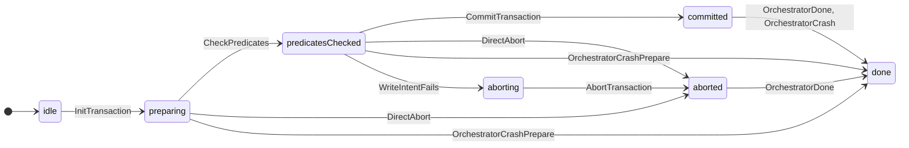
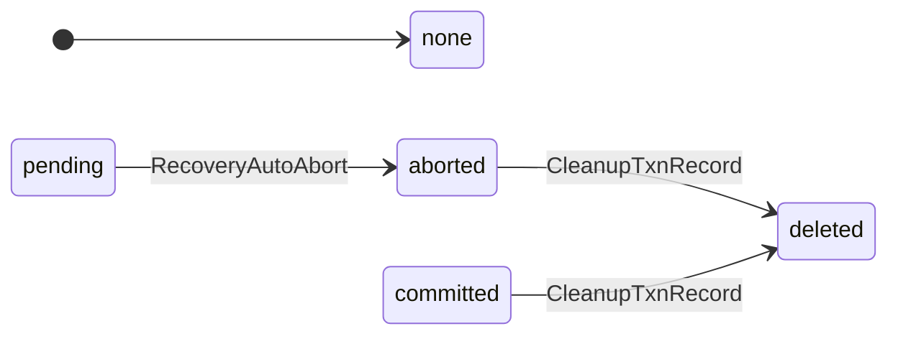
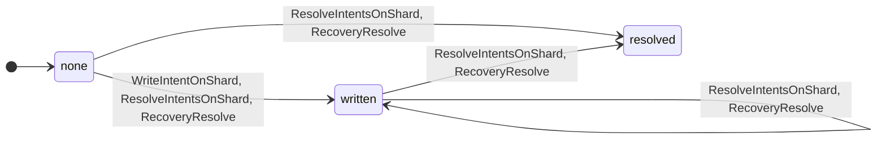
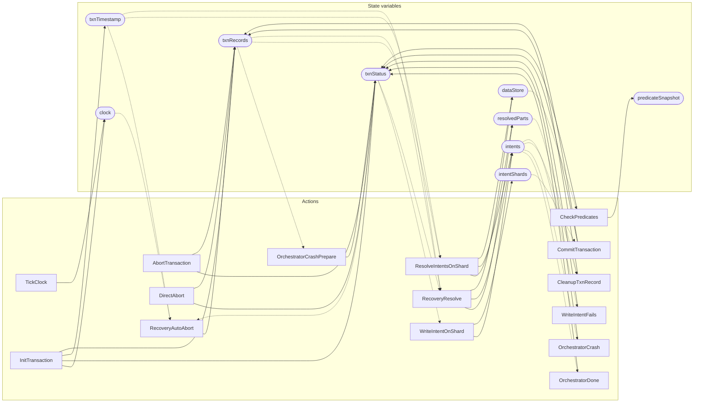

<!-- GENERATED FILE: do not edit. Regenerate with `make -C zig tla-viz` (scripts/tla-viz/gen_structural.py). -->

# AntflyTransaction — structural diagrams

Generated from [`AntflyTransaction.tla`](../../../storage/db/AntflyTransaction.tla). 9 state variables, 15 actions in `Next`.

## Phase state machines

Transitions are extracted from action guards and primed updates; edge labels are the actions that perform the transition.

### `txnStatus`

### `txnRecords`

Writes whose source state is not statically determined:

- `AbortTransaction` sets `txnRecords` to `"aborted"`
- `CommitTransaction` sets `txnRecords` to `"committed"`
- `DirectAbort` sets `txnRecords` to `"aborted"`
- `InitTransaction` sets `txnRecords` to `"pending"`

### `intents`

## Actions and the state they touch

| Action | Reads (incl. helper operators) | Writes |
| --- | --- | --- |
| `TickClock` | `clock` | `clock` |
| `InitTransaction` | `clock`, `txnStatus`, `txnTimestamp`, `txnRecords` | `clock`, `txnStatus`, `txnTimestamp`, `txnRecords` |
| `CheckPredicates` | `txnStatus`, `dataStore`, `predicateSnapshot` | `txnStatus`, `predicateSnapshot` |
| `CommitTransaction` | `txnStatus`, `txnRecords`, `intentShards` | `txnStatus`, `txnRecords` |
| `AbortTransaction` | `txnStatus`, `txnRecords` | `txnStatus`, `txnRecords` |
| `DirectAbort` | `txnStatus`, `txnRecords` | `txnStatus`, `txnRecords` |
| `OrchestratorDone` | `txnStatus`, `intents` | `txnStatus` |
| `OrchestratorCrash` | `txnStatus`, `intents` | `txnStatus` |
| `OrchestratorCrashPrepare` | `txnStatus`, `txnRecords` | `txnStatus` |
| `RecoveryAutoAbort` | `clock`, `txnStatus`, `txnTimestamp`, `txnRecords` | `txnRecords` |
| `CleanupTxnRecord` | `txnRecords`, `resolvedParts`, `intents` | `txnRecords` |
| `WriteIntentOnShard` | `txnStatus`, `txnRecords`, `intents`, `dataStore`, `intentShards`, `predicateSnapshot` | `intents`, `intentShards` |
| `WriteIntentFails` | `txnStatus`, `txnRecords`, `intents`, `dataStore`, `predicateSnapshot` | `txnStatus` |
| `ResolveIntentsOnShard` | `txnTimestamp`, `txnRecords`, `resolvedParts`, `intents`, `dataStore` | `resolvedParts`, `intents`, `dataStore` |
| `RecoveryResolve` | `txnStatus`, `txnTimestamp`, `txnRecords`, `resolvedParts`, `intents`, `dataStore` | `resolvedParts`, `intents`, `dataStore` |

## Write graph

Solid edges: the action updates the variable. Dotted edges: the action's own definition reads the variable (reads via helper operators appear in the table above, not here).

