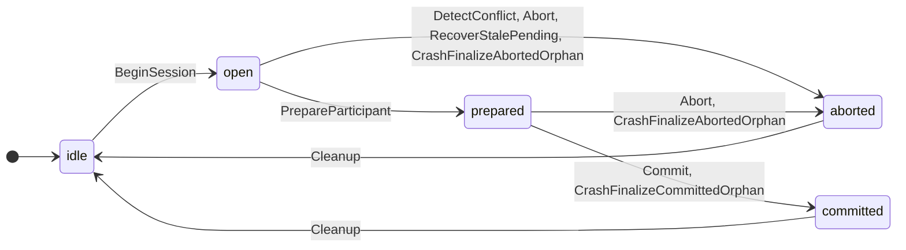
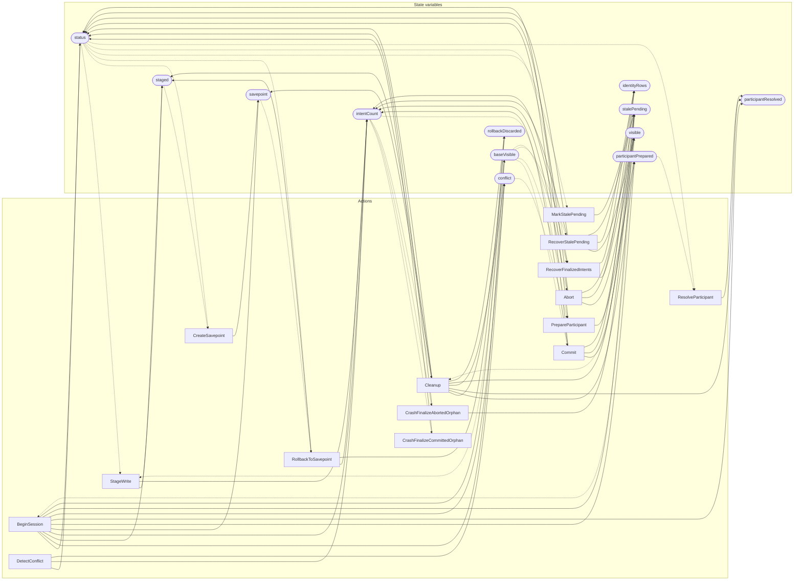

<!-- GENERATED FILE: do not edit. Regenerate with `make -C zig tla-viz` (scripts/tla-viz/gen_structural.py). -->

# AntflyTransactionSession — structural diagrams

Generated from [`AntflyTransactionSession.tla`](../../../storage/db/AntflyTransactionSession.tla). 13 state variables, 15 actions in `Next`. 3 expected-failure mutant action(s) (gated by `Buggy*` constants) omitted.

## Phase state machines

Transitions are extracted from action guards and primed updates; edge labels are the actions that perform the transition.

### `status`

## Actions and the state they touch

| Action | Reads (incl. helper operators) | Writes |
| --- | --- | --- |
| `BeginSession` | `status`, `visible` | `status`, `baseVisible`, `staged`, `intentCount`, `savepoint`, `participantPrepared`, `participantResolved`, `conflict`, `stalePending`, `rollbackDiscarded` |
| `StageWrite` | `status`, `baseVisible`, `staged`, `intentCount` | `staged`, `intentCount` |
| `CreateSavepoint` | `status`, `staged` | `savepoint` |
| `RollbackToSavepoint` | `status`, `staged`, `savepoint` | `staged`, `intentCount`, `rollbackDiscarded` |
| `DetectConflict` | `status` | `status`, `intentCount`, `conflict` |
| `Commit` | `status`, `baseVisible`, `intentCount` | `status`, `intentCount`, `visible`, `identityRows`, `stalePending` |
| `Abort` | `status`, `baseVisible` | `status`, `intentCount`, `visible`, `identityRows`, `stalePending` |
| `MarkStalePending` | `status` | `stalePending` |
| `RecoverStalePending` | `status`, `baseVisible`, `stalePending` | `status`, `intentCount`, `visible`, `identityRows`, `stalePending` |
| `CrashFinalizeCommittedOrphan` | `status`, `intentCount` | `status` |
| `CrashFinalizeAbortedOrphan` | `status`, `intentCount` | `status`, `stalePending` |
| `RecoverFinalizedIntents` | `status`, `baseVisible`, `intentCount` | `intentCount`, `visible`, `identityRows` |
| `Cleanup` | `status`, `intentCount`, `participantPrepared`, `participantResolved`, `visible` | `status`, `baseVisible`, `staged`, `savepoint`, `participantPrepared`, `participantResolved`, `conflict`, `stalePending`, `rollbackDiscarded` |
| `PrepareParticipant` | `status`, `intentCount`, `participantPrepared`, `conflict` | `status`, `participantPrepared` |
| `ResolveParticipant` | `status`, `participantPrepared`, `participantResolved` | `participantResolved` |

## Write graph

Solid edges: the action updates the variable. Dotted edges: the action's own definition reads the variable (reads via helper operators appear in the table above, not here).

