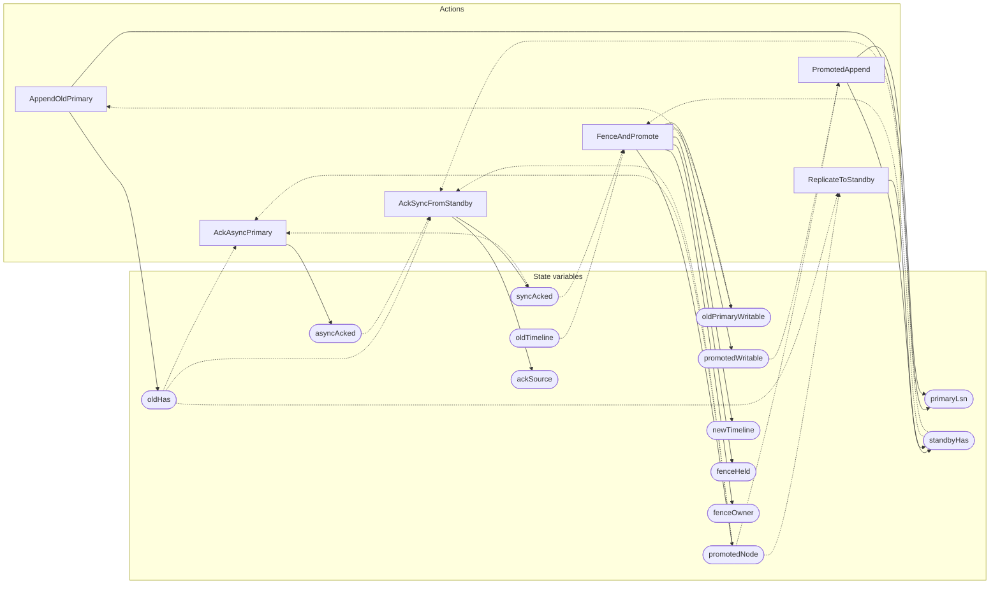

<!-- GENERATED FILE: do not edit. Regenerate with `make -C zig tla-viz` (scripts/tla-viz/gen_structural.py). -->

# AntflyHAFailoverSafety — structural diagrams

Generated from [`AntflyHAFailoverSafety.tla`](../../../storage/ha/AntflyHAFailoverSafety.tla). 14 state variables, 6 actions in `Next`. 1 expected-failure mutant action(s) (gated by `Buggy*` constants) omitted.

## Actions and the state they touch

| Action | Reads (incl. helper operators) | Writes |
| --- | --- | --- |
| `AppendOldPrimary` | `primaryLsn`, `oldPrimaryWritable`, `oldHas` | `primaryLsn`, `oldHas` |
| `PromotedAppend` | `primaryLsn`, `promotedNode`, `promotedWritable`, `standbyHas` | `primaryLsn`, `standbyHas` |
| `AckAsyncPrimary` | `promotedNode`, `oldHas`, `syncAcked`, `asyncAcked` | `asyncAcked` |
| `FenceAndPromote` | `promotedNode`, `oldTimeline`, `standbyHas`, `syncAcked` | `oldPrimaryWritable`, `promotedNode`, `promotedWritable`, `newTimeline`, `fenceHeld`, `fenceOwner` |
| `ReplicateToStandby` | `promotedNode`, `oldHas`, `standbyHas` | `standbyHas` |
| `AckSyncFromStandby` | `promotedNode`, `oldHas`, `standbyHas`, `syncAcked`, `asyncAcked`, `ackSource` | `syncAcked`, `ackSource` |

## Write graph

Solid edges: the action updates the variable. Dotted edges: the action's own definition reads the variable (reads via helper operators appear in the table above, not here).

