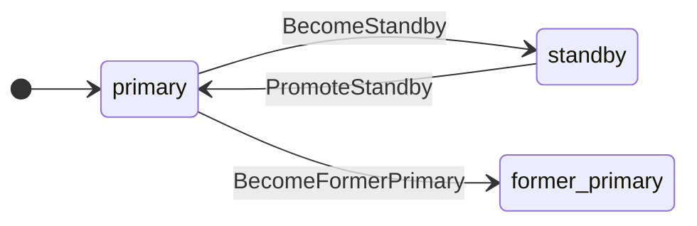
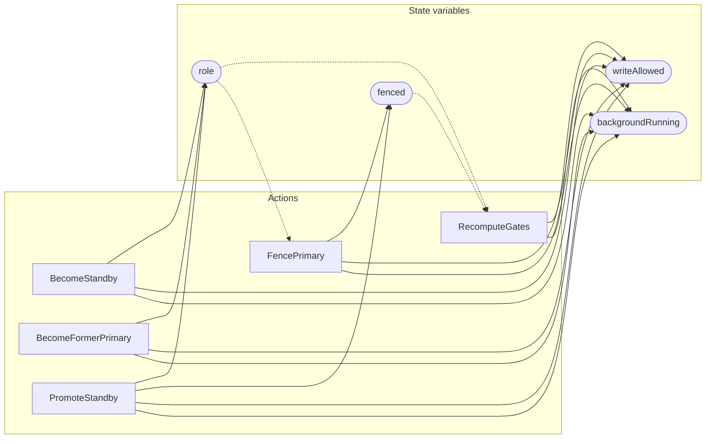

<!-- GENERATED FILE: do not edit. Regenerate with `make -C zig tla-viz` (scripts/tla-viz/gen_structural.py). -->

# AntflyHAGateTransitions — structural diagrams

Generated from [`AntflyHAGateTransitions.tla`](../../../storage/ha/AntflyHAGateTransitions.tla). 4 state variables, 5 actions in `Next`.

## Phase state machines

Transitions are extracted from action guards and primed updates; edge labels are the actions that perform the transition.

### `role`

## Actions and the state they touch

| Action | Reads (incl. helper operators) | Writes |
| --- | --- | --- |
| `RecomputeGates` | `role`, `fenced` | `writeAllowed`, `backgroundRunning` |
| `BecomeStandby` | `role` | `role`, `writeAllowed`, `backgroundRunning` |
| `BecomeFormerPrimary` | `role` | `role`, `writeAllowed`, `backgroundRunning` |
| `FencePrimary` | `role`, `fenced` | `fenced`, `writeAllowed`, `backgroundRunning` |
| `PromoteStandby` | `role`, `fenced` | `role`, `fenced`, `writeAllowed`, `backgroundRunning` |

## Write graph

Solid edges: the action updates the variable. Dotted edges: the action's own definition reads the variable (reads via helper operators appear in the table above, not here).

