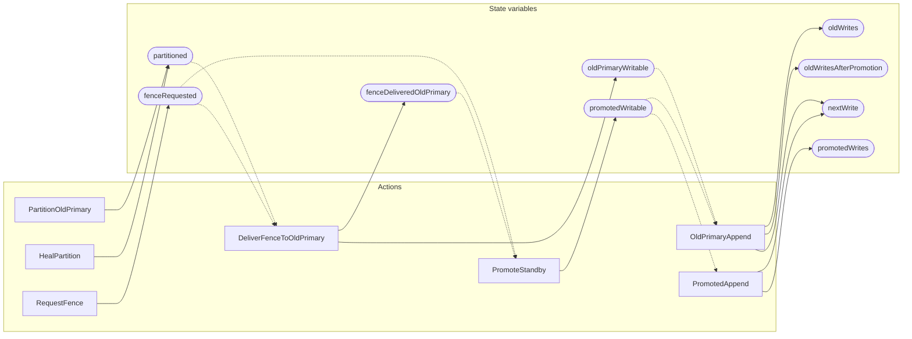

<!-- GENERATED FILE: do not edit. Regenerate with `make -C zig tla-viz` (scripts/tla-viz/gen_structural.py). -->

# AntflyHAPartitionFence — structural diagrams

Generated from [`AntflyHAPartitionFence.tla`](../../../storage/ha/AntflyHAPartitionFence.tla). 9 state variables, 7 actions in `Next`.

## Actions and the state they touch

| Action | Reads (incl. helper operators) | Writes |
| --- | --- | --- |
| `PartitionOldPrimary` | `partitioned` | `partitioned` |
| `RequestFence` | `fenceRequested` | `fenceRequested` |
| `DeliverFenceToOldPrimary` | `partitioned`, `fenceRequested`, `fenceDeliveredOldPrimary` | `fenceDeliveredOldPrimary`, `oldPrimaryWritable` |
| `HealPartition` | `partitioned` | `partitioned` |
| `PromoteStandby` | `fenceRequested`, `fenceDeliveredOldPrimary`, `promotedWritable` | `promotedWritable` |
| `OldPrimaryAppend` | `oldPrimaryWritable`, `promotedWritable`, `oldWrites`, `oldWritesAfterPromotion`, `nextWrite` | `oldWrites`, `oldWritesAfterPromotion`, `nextWrite` |
| `PromotedAppend` | `promotedWritable`, `promotedWrites`, `nextWrite` | `promotedWrites`, `nextWrite` |

## Write graph

Solid edges: the action updates the variable. Dotted edges: the action's own definition reads the variable (reads via helper operators appear in the table above, not here).

