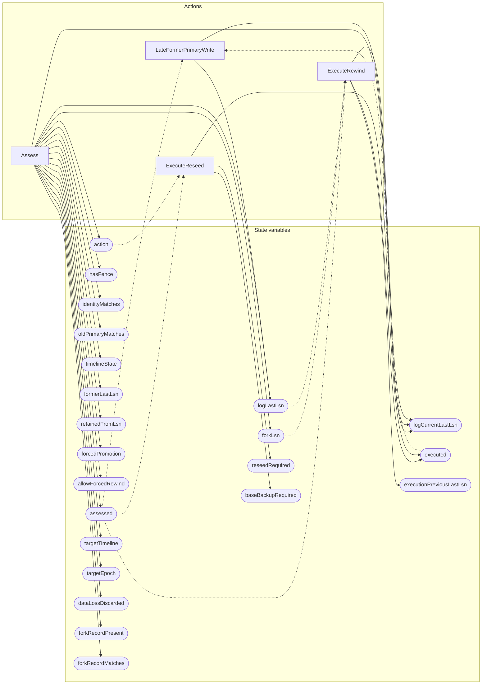

<!-- GENERATED FILE: do not edit. Regenerate with `make -C zig tla-viz` (scripts/tla-viz/gen_structural.py). -->

# AntflyHARejoin — structural diagrams

Generated from [`AntflyHARejoin.tla`](../../../storage/ha/AntflyHARejoin.tla). 22 state variables, 4 actions in `Next`.

## Phase state machines

Transitions are extracted from action guards and primed updates; edge labels are the actions that perform the transition.

### `timelineState`

Domain: `parent`, `new`, `other`. No statically extractable guard/update transitions.

### `action`

Domain: `none`, `reject_unfenced`, `already_current`, `rewind`, `reseed`. No statically extractable guard/update transitions.

## Actions and the state they touch

| Action | Reads (incl. helper operators) | Writes |
| --- | --- | --- |
| `Assess` | `assessed` | `assessed`, `hasFence`, `identityMatches`, `oldPrimaryMatches`, `timelineState`, `formerLastLsn`, `forkLsn`, `retainedFromLsn`, `forcedPromotion`, `allowForcedRewind`, `action`, `targetTimeline`, `targetEpoch`, `dataLossDiscarded`, `logLastLsn`, `logCurrentLastLsn`, `forkRecordPresent`, `forkRecordMatches` |
| `LateFormerPrimaryWrite` | `assessed`, `logLastLsn`, `executed` | `logLastLsn`, `logCurrentLastLsn` |
| `ExecuteRewind` | `assessed`, `formerLastLsn`, `forkLsn`, `retainedFromLsn`, `action`, `logLastLsn`, `forkRecordPresent`, `forkRecordMatches`, `executed` | `logCurrentLastLsn`, `executed`, `executionPreviousLastLsn` |
| `ExecuteReseed` | `assessed`, `action`, `executed` | `executed`, `reseedRequired`, `baseBackupRequired` |

## Write graph

Solid edges: the action updates the variable. Dotted edges: the action's own definition reads the variable (reads via helper operators appear in the table above, not here).

