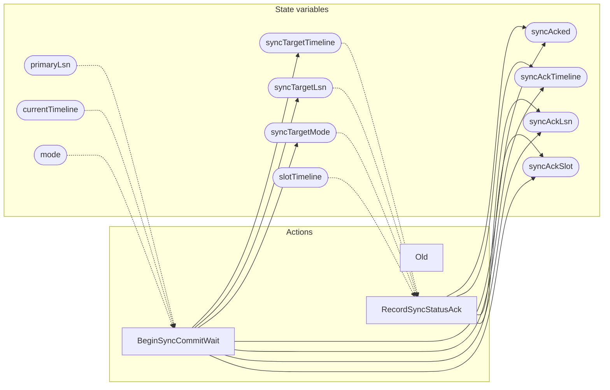

<!-- GENERATED FILE: do not edit. Regenerate with `make -C zig tla-viz` (scripts/tla-viz/gen_structural.py). -->

# AntflyHAReplication — structural diagrams

Generated from [`AntflyHAReplication.tla`](../../../storage/ha/AntflyHAReplication.tla). 41 state variables, 3 actions in `Next`. 1 expected-failure mutant action(s) (gated by `Buggy*` constants) omitted.

## Phase state machines

Transitions are extracted from action guards and primed updates; edge labels are the actions that perform the transition.

### `mode`

Domain: `async`, `remote_write`, `remote_apply`. No statically extractable guard/update transitions.

### `selection`

Domain: `any`, `first`, `all`. No statically extractable guard/update transitions.

### `failurePolicy`

Domain: `block`, `fail_closed`, `degrade_to_async`. No statically extractable guard/update transitions.

### `durabilityStatus`

Domain: `satisfied`, `would_block`, `fail_closed`, `degraded_to_async`. No statically extractable guard/update transitions.

### `rejoinAction`

Domain: `none`, `reject_unfenced`, `already_current`, `rewind`, `reseed`. No statically extractable guard/update transitions.

## Actions and the state they touch

| Action | Reads (incl. helper operators) | Writes |
| --- | --- | --- |
| `Old` | — | — |
| `BeginSyncCommitWait` | `primaryLsn`, `currentTimeline`, `mode` | `syncTargetTimeline`, `syncTargetLsn`, `syncTargetMode`, `syncAcked`, `syncAckTimeline`, `syncAckLsn`, `syncAckSlot` |
| `RecordSyncStatusAck` | `currentTimeline`, `slotTimeline`, `slotActive`, `slotReseed`, `receivedLsn`, `appliedLsn`, `syncTargetTimeline`, `syncTargetLsn`, `syncTargetMode` | `syncAcked`, `syncAckTimeline`, `syncAckLsn`, `syncAckSlot` |

## Write graph

Solid edges: the action updates the variable. Dotted edges: the action's own definition reads the variable (reads via helper operators appear in the table above, not here).

