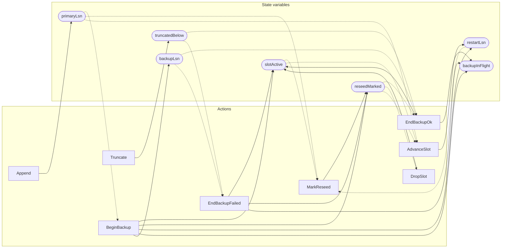

<!-- GENERATED FILE: do not edit. Regenerate with `make -C zig tla-viz` (scripts/tla-viz/gen_structural.py). -->

# AntflyHARetentionReseed — structural diagrams

Generated from [`AntflyHARetentionReseed.tla`](../../../storage/ha/AntflyHARetentionReseed.tla). 8 state variables, 8 actions in `Next`. 1 expected-failure mutant action(s) (gated by `Buggy*` constants) omitted.

## Actions and the state they touch

| Action | Reads (incl. helper operators) | Writes |
| --- | --- | --- |
| `Append` | `primaryLsn` | `primaryLsn` |
| `Truncate` | `primaryLsn`, `slotActive`, `reseedMarked`, `restartLsn`, `truncatedBelow` | `truncatedBelow` |
| `BeginBackup` | `primaryLsn`, `slotActive`, `reseedMarked`, `restartLsn`, `backupInFlight` | `slotActive`, `reseedMarked`, `restartLsn`, `backupInFlight`, `backupLsn` |
| `EndBackupOk` | `slotActive`, `reseedMarked`, `truncatedBelow`, `backupInFlight`, `backupLsn` | `slotActive`, `backupInFlight` |
| `EndBackupFailed` | `slotActive`, `reseedMarked`, `truncatedBelow`, `backupInFlight`, `backupLsn` | `slotActive`, `reseedMarked`, `backupInFlight` |
| `MarkReseed` | `primaryLsn`, `slotActive`, `reseedMarked`, `restartLsn` | `reseedMarked` |
| `DropSlot` | `slotActive`, `reseedMarked` | `slotActive` |
| `AdvanceSlot` | `primaryLsn`, `slotActive`, `reseedMarked`, `restartLsn` | `restartLsn` |

## Write graph

Solid edges: the action updates the variable. Dotted edges: the action's own definition reads the variable (reads via helper operators appear in the table above, not here).

