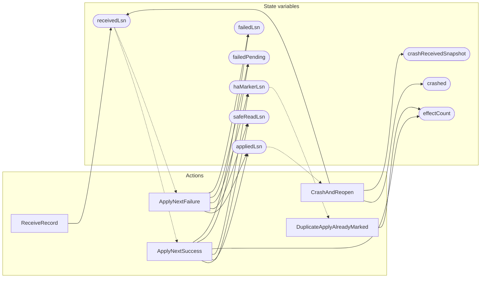

<!-- GENERATED FILE: do not edit. Regenerate with `make -C zig tla-viz` (scripts/tla-viz/gen_structural.py). -->

# AntflyHAStandbyApply — structural diagrams

Generated from [`AntflyHAStandbyApply.tla`](../../../storage/ha/AntflyHAStandbyApply.tla). 11 state variables, 5 actions in `Next`. 2 expected-failure mutant action(s) (gated by `Buggy*` constants) omitted.

## Actions and the state they touch

| Action | Reads (incl. helper operators) | Writes |
| --- | --- | --- |
| `ReceiveRecord` | `receivedLsn` | `receivedLsn` |
| `ApplyNextSuccess` | `receivedLsn`, `appliedLsn`, `effectCount`, `failedPending`, `failedLsn` | `appliedLsn`, `safeReadLsn`, `haMarkerLsn`, `effectCount`, `failedPending`, `failedLsn` |
| `ApplyNextFailure` | `receivedLsn`, `appliedLsn`, `failedPending` | `appliedLsn`, `safeReadLsn`, `haMarkerLsn`, `failedPending`, `failedLsn` |
| `DuplicateApplyAlreadyMarked` | `haMarkerLsn`, `effectCount` | `effectCount` |
| `CrashAndReopen` | `receivedLsn`, `appliedLsn`, `crashed` | `receivedLsn`, `crashed`, `crashReceivedSnapshot` |

## Write graph

Solid edges: the action updates the variable. Dotted edges: the action's own definition reads the variable (reads via helper operators appear in the table above, not here).

