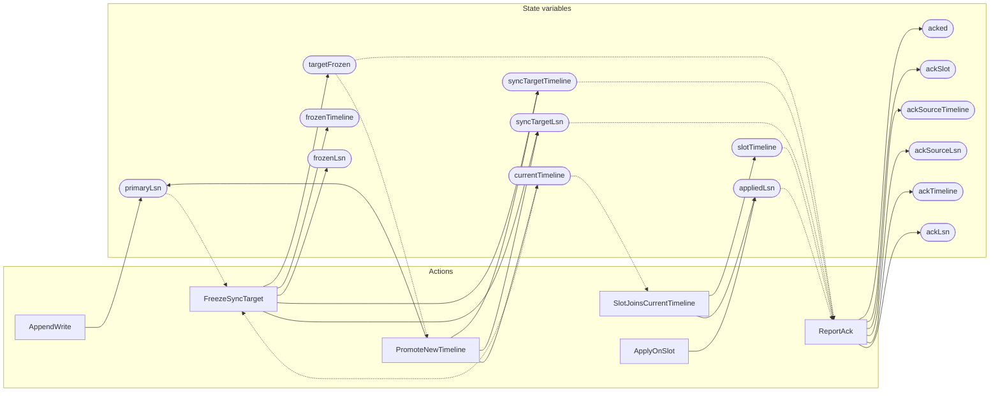

<!-- GENERATED FILE: do not edit. Regenerate with `make -C zig tla-viz` (scripts/tla-viz/gen_structural.py). -->

# AntflyHASyncWait — structural diagrams

Generated from [`AntflyHASyncWait.tla`](../../../storage/ha/AntflyHASyncWait.tla). 15 state variables, 6 actions in `Next`.

## Actions and the state they touch

| Action | Reads (incl. helper operators) | Writes |
| --- | --- | --- |
| `AppendWrite` | `primaryLsn` | `primaryLsn` |
| `FreezeSyncTarget` | `currentTimeline`, `primaryLsn`, `targetFrozen` | `targetFrozen`, `syncTargetTimeline`, `syncTargetLsn`, `frozenTimeline`, `frozenLsn` |
| `PromoteNewTimeline` | `currentTimeline`, `targetFrozen` | `currentTimeline`, `primaryLsn`, `syncTargetTimeline`, `syncTargetLsn` |
| `SlotJoinsCurrentTimeline` | `currentTimeline`, `slotTimeline`, `appliedLsn` | `slotTimeline`, `appliedLsn` |
| `ApplyOnSlot` | `appliedLsn` | `appliedLsn` |
| `ReportAck` | `targetFrozen`, `syncTargetTimeline`, `syncTargetLsn`, `slotTimeline`, `appliedLsn`, `acked` | `acked`, `ackSlot`, `ackSourceTimeline`, `ackSourceLsn`, `ackTimeline`, `ackLsn` |

## Write graph

Solid edges: the action updates the variable. Dotted edges: the action's own definition reads the variable (reads via helper operators appear in the table above, not here).

