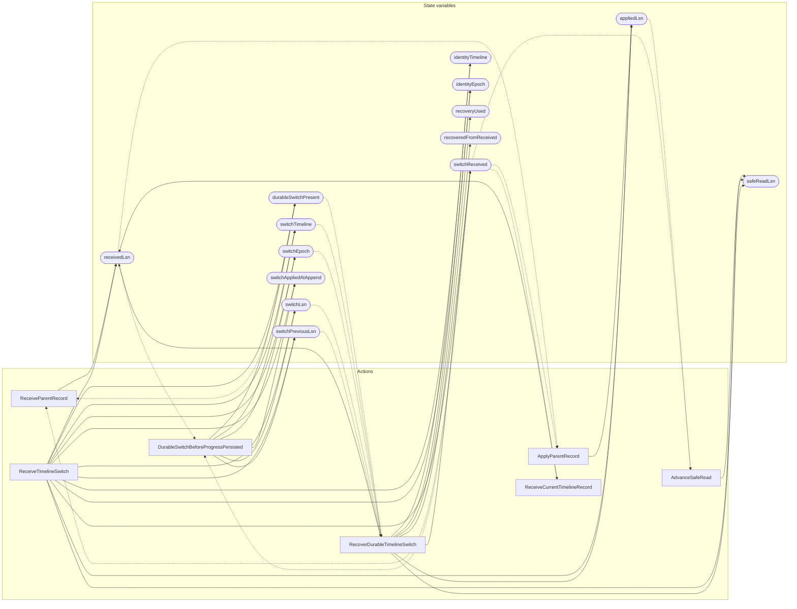

<!-- GENERATED FILE: do not edit. Regenerate with `make -C zig tla-viz` (scripts/tla-viz/gen_structural.py). -->

# AntflyHATimelineSwitch — structural diagrams

Generated from [`AntflyHATimelineSwitch.tla`](../../../storage/ha/AntflyHATimelineSwitch.tla). 15 state variables, 7 actions in `Next`. 1 expected-failure mutant action(s) (gated by `Buggy*` constants) omitted.

## Actions and the state they touch

| Action | Reads (incl. helper operators) | Writes |
| --- | --- | --- |
| `ReceiveParentRecord` | `receivedLsn`, `durableSwitchPresent`, `switchReceived` | `receivedLsn` |
| `ApplyParentRecord` | `receivedLsn`, `appliedLsn`, `switchReceived` | `appliedLsn` |
| `AdvanceSafeRead` | `appliedLsn`, `safeReadLsn`, `switchReceived` | `safeReadLsn` |
| `ReceiveTimelineSwitch` | `receivedLsn`, `appliedLsn`, `safeReadLsn`, `durableSwitchPresent`, `switchReceived` | `identityTimeline`, `identityEpoch`, `receivedLsn`, `appliedLsn`, `safeReadLsn`, `durableSwitchPresent`, `switchTimeline`, `switchEpoch`, `switchLsn`, `switchPreviousLsn`, `switchAppliedAtAppend`, `switchReceived` |
| `DurableSwitchBeforeProgressPersisted` | `receivedLsn`, `appliedLsn`, `safeReadLsn`, `durableSwitchPresent`, `switchReceived` | `durableSwitchPresent`, `switchTimeline`, `switchEpoch`, `switchLsn`, `switchPreviousLsn`, `switchAppliedAtAppend` |
| `RecoverDurableTimelineSwitch` | `receivedLsn`, `appliedLsn`, `safeReadLsn`, `durableSwitchPresent`, `switchTimeline`, `switchEpoch`, `switchLsn`, `switchPreviousLsn`, `switchReceived` | `identityTimeline`, `identityEpoch`, `receivedLsn`, `appliedLsn`, `safeReadLsn`, `switchReceived`, `recoveryUsed`, `recoveredFromReceived` |
| `ReceiveCurrentTimelineRecord` | `receivedLsn`, `switchReceived` | `receivedLsn` |

## Write graph

Solid edges: the action updates the variable. Dotted edges: the action's own definition reads the variable (reads via helper operators appear in the table above, not here).

