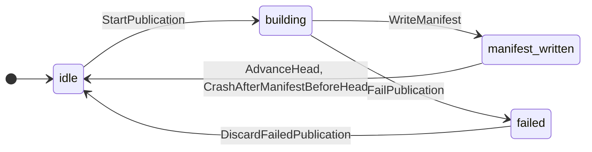
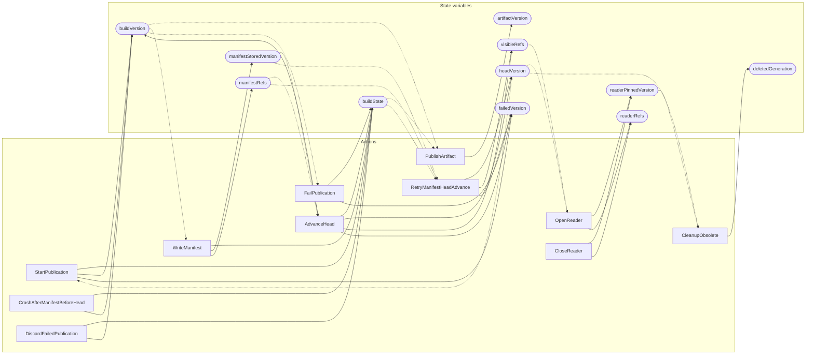

<!-- GENERATED FILE: do not edit. Regenerate with `make -C zig tla-viz` (scripts/tla-viz/gen_structural.py). -->

# AntflyLitePublication — structural diagrams

Generated from [`AntflyLitePublication.tla`](../../../storage/lite/AntflyLitePublication.tla). 11 state variables, 11 actions in `Next`. 4 expected-failure mutant action(s) (gated by `Buggy*` constants) omitted.

## Phase state machines

Transitions are extracted from action guards and primed updates; edge labels are the actions that perform the transition.

### `buildState`

## Actions and the state they touch

| Action | Reads (incl. helper operators) | Writes |
| --- | --- | --- |
| `StartPublication` | `buildState`, `headVersion` | `buildState`, `buildVersion`, `failedVersion` |
| `PublishArtifact` | `buildState`, `buildVersion`, `artifactVersion` | `artifactVersion` |
| `WriteManifest` | `buildState`, `buildVersion`, `artifactVersion` | `buildState`, `manifestStoredVersion`, `manifestRefs` |
| `AdvanceHead` | `buildState`, `buildVersion`, `artifactVersion`, `manifestStoredVersion`, `manifestRefs` | `buildState`, `buildVersion`, `headVersion`, `visibleRefs`, `failedVersion` |
| `CrashAfterManifestBeforeHead` | `buildState` | `buildState`, `buildVersion` |
| `RetryManifestHeadAdvance` | `buildState`, `artifactVersion`, `manifestStoredVersion`, `manifestRefs`, `headVersion` | `headVersion`, `visibleRefs`, `failedVersion` |
| `FailPublication` | `buildState`, `buildVersion` | `buildState`, `failedVersion` |
| `DiscardFailedPublication` | `buildState` | `buildState`, `buildVersion` |
| `OpenReader` | `headVersion`, `visibleRefs`, `readerPinnedVersion` | `readerPinnedVersion`, `readerRefs` |
| `CloseReader` | `readerPinnedVersion` | `readerPinnedVersion`, `readerRefs` |
| `CleanupObsolete` | `headVersion`, `readerPinnedVersion`, `deletedGeneration` | `deletedGeneration` |

## Write graph

Solid edges: the action updates the variable. Dotted edges: the action's own definition reads the variable (reads via helper operators appear in the table above, not here).

